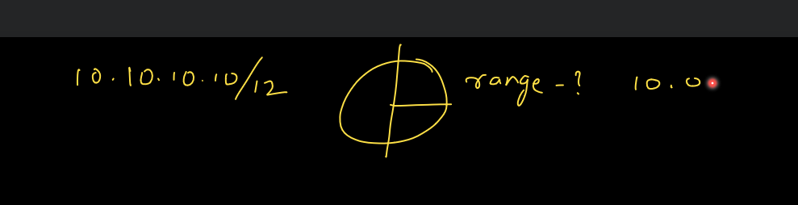
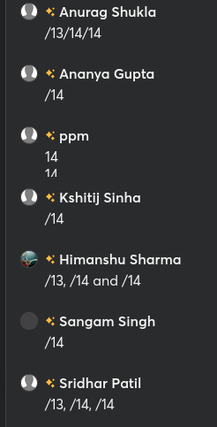
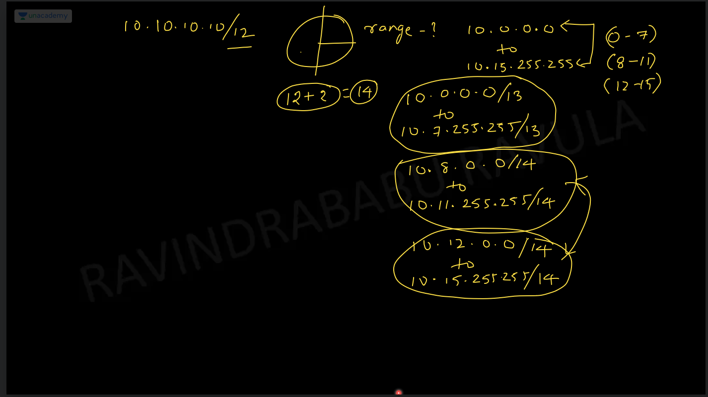
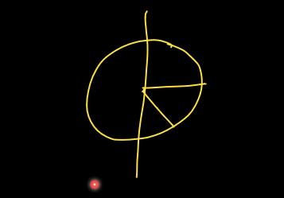
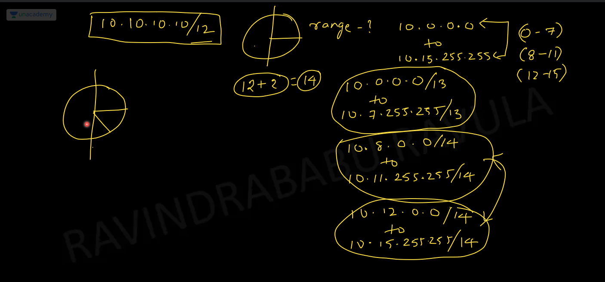
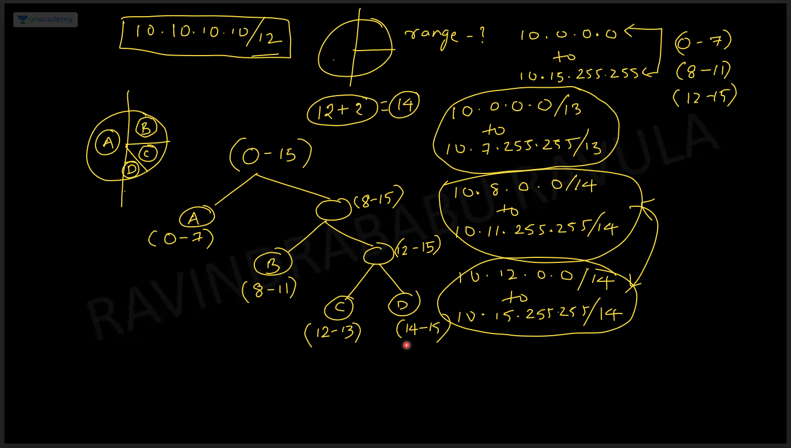
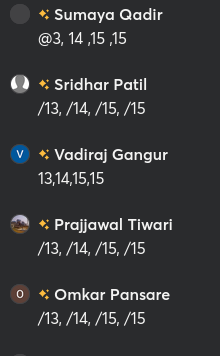
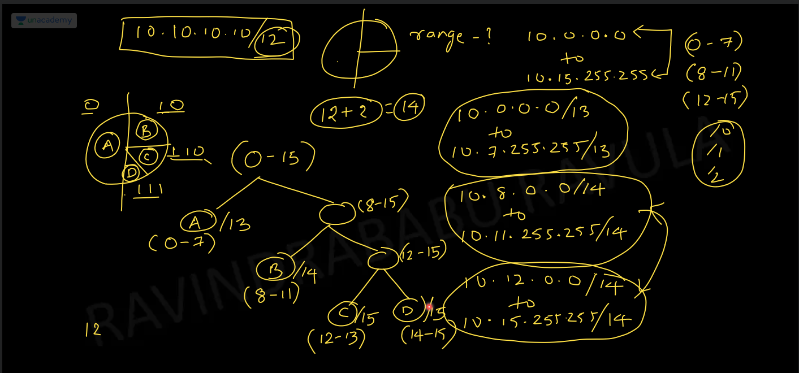
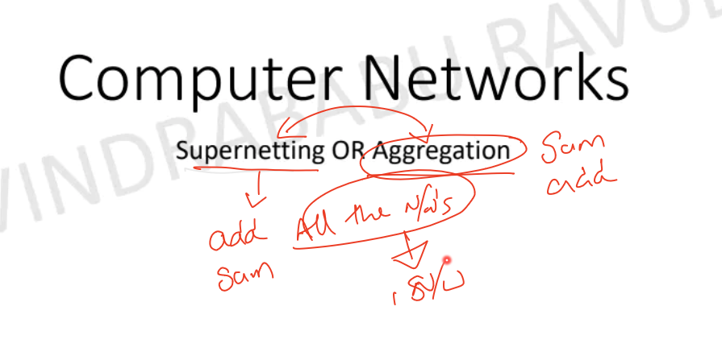
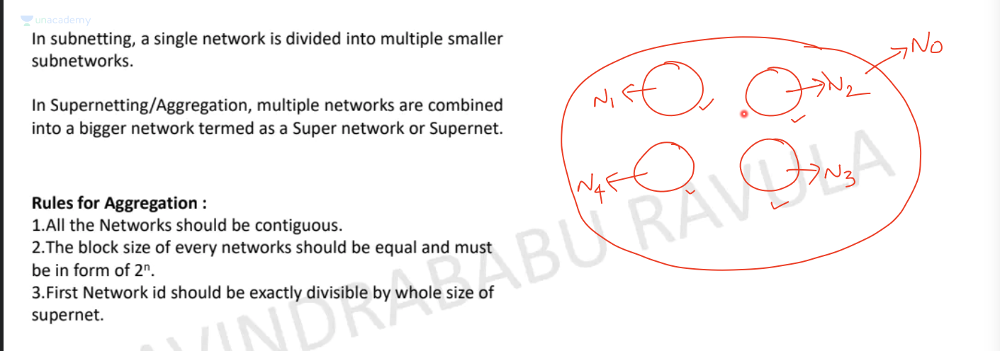

# Computer Network

* Link -> https://unacademy.com/@ravula/courses?goal=NVLIA&type=plus

# Part-1

* Link -> https://unacademy.com/course/computer-networks-complete-course/YGKC2V5S

## Introduction to computer networks and ip addressing (1) [27th June 2023]

* Whenever a process tries to get some information from some other process, the process which **sends the information** is called as the **server**. The process which **takes the information** is called as the **client**.

* Process is nothing but a program which is running.

> Client will sent a request when writing **www.google.com**, the request has to go to the process via server.

* Steps:-

1) Identifying the Network
2) Identifying the host within the network
3) Identifying the process within the host.

* IP address is going to have **two** parts

1) Network ID -> It is used to identify the **newtork**.
2) Host ID -> It is used to identify the **host**.

* Socket No -> This is used to identify the **process**. 

* IP -> Internet Protocol.

* Yes

* What happens when we type **www.google.com**?

> In my network, we have the ISP. It is the responsibility of your ISP to provide us with one more server network called as **DNS(Domain name server)**.

* What is the purpose of DNS?

> If we have to contact google, we need the IP address of google servers, but we don't know the IP address of google servers, we only know the domain name.
> Before contacting google, we have to contact the **DNS** and **DNS** is going to us the IP address.
> We are giving **domain name** to DNS and we are getting the IP address in return.
> Before we actually communicate with the server, we communicate with the **DNS**.

* For the communication between me sending the **domain name** and getting the IP address in return, this takes **some time**. This time is **wasted** and it is actually unnecessary. It is called as **DNS overhead**.   

* ISP -> Internet Service Provider
* DNS -> Domain name server.

## Binary System

* With 1 bit -> 2 ^ 1 -> 2 Combinations
* With 2 bits -> 2 ^ 2 -> 4 Combinations
* With 3 bits -> 2 ^ 3 -> 8 Combinations
* With 'n' bits -> 2 ^ n -> (2 ^ n) Combinations

* If there is 'n' bit no and we are choosing 'k' bits. That menas we are dividing entire numbers in (2 ^ K) parts.
* (2 ^ n) / (2 ^ k) -> 2 ^ (n -k)

* We have a **n** bit number. If we choose **K** bits for **Network ID** and **n-k** bits for **Host ID**, then
* How many networks are possible?

> **2 ^ k** networks.

* How many hosts are possible per network?

> **2 ^ (n-k)** hosts.

* If we have **n** bits and we choose **k** bits from **n** bits then **2 ^ k** groups are possible and size of each group is **2 ^ (n - k)**.

 

## IP Address

* 32 Bits.
* Even though IP address is **32 bit** number, we represented it in decimal numbers.
* 20.1.2.3 -> **Dotted Decimal Representation**

* The **8 bits** are called as **Octets**.
* Octa -> 8 bits
* The Octets are divided into **2** componenets -> **Netword ID and Host ID**.

* Binary and Decimal Representation, both representation are given in exam
* Network ID(NID) -> It represents the IP address of the network and is used to identify the network.
* Host ID(HID) -> It represents the IP address of the host and is used to identify the host within the network.

* 32 Bits -> 8 bits network ID and 24 bits Host ID -> This is called as **static division**.
* 8 bits -> 2 ^ 8 -> 256 networks.
* 24 bits -> 2 ^ 24 -> 16 Million hosts in one network.

* Disadvantages of **static division**:-

1) Networks are too low
2) Too many hosts per network.  

* So, **static division** doesn't work.
* They have done dynamic division called as **classfull addressing**.

## Classfull addressing

* We have **2 ^ 32** bits. If we fix **one bit** then we will have **2 ^ 31** bits.
* 2 ^ 31 = 2 ^ 32 / 2 ^ 1

> So, 2 ^ 32 is divided into **two parts**, one is starting with **0** and the other part is starting with **1**.

* The part is starting with **0** is called as the **class A**.

* All the nos(2 ^ 31) starting with **1** are remaining.

> So, 2 ^ 31 is divided into **two parts**, one is starting with **10** and the other part is starting with **11**.

* The part is starting with **10** is called as the **class B**.

* All the nos(2 ^ 30) starting with **11** are remaining.

> So, 2 ^ 30 is divided into **two parts**, one is starting with **110** and the other part is starting with **111**.

* The part is starting with **110** is called as the **class C**.

* All the nos(2 ^ 29) starting with **111** are remaining.

> So, 2 ^ 29 is divided into **two parts**, one is starting with **1110** and the other part is starting with **1111**.

* The part starting with **1110** is called as the **class D**.
* The part starting with **1111** is called as the **class E**.

* The beauty of the concept is that if we take any IP address and we convert it into **binary number**, adn we look at the **first** few bits. We will be able to say what is the **class of the IP address**.

* Totally we have -> 2 ^ 32 bits.
* Total no. of IP addresses present in **Class A** -> Fix **1 bit(0)** -> 2 ^ 31.
* Total no. of IP addresses present in **Class B** -> Fix **2 bits(10)** -> 2 ^ 30.
* Total no. of IP addresses present in **Class C** -> Fix **3 bits(110)** -> 2 ^ 29.
* Total no. of IP addresses present in **Class D** -> Fix **4 bits(1110)** -> 2 ^ 28.
* Total no. of IP addresses present in **Class E** -> Fix **4 bits(1111)** -> 2 ^ 28.

* **Class A**:-
* Min. value of 1st octet -> 00000000 -> 0
* Max value of 1st octet -> 01111111 -> (2 ^ 7) - 1 -> 128 - 1 -> 127
* Range of 1st octet -> [0, 127]

* **Class B**:-
* Min. value of 1st octet -> 10000000 -> 128
* Max value of 1st octet -> 10111111 -> 2 ^ 7 + 2 ^ 6 - 1 -> 128 + 63 -> -> 191
* Range of 1st octet -> [128, 191]

* **Class C**:-
* Min. value of 1st octet -> 11000000 -> 192
* Max value of 1st octet -> 11011111 -> 223
* Range of 1st octet -> [192, 223]

* **Class D**:-
* Min. value of 1st octet -> 11100000 -> 224
* Max value of 1st octet -> 11101111 -> 239
* Range of 1st octet -> [224, 239]

* **Class E**:-
* Min. value of 1st octet -> 11110000 -> 240
* Max value of 1st octet -> 11111111 -> 255
* Range of 1st octet -> [240, 255]

* [**IMPORTANT**]

* By looking at the **first octet** we will be able to say what **class** does the IP address belong to.
* Class **A** starts with **0**.
* In the **first octet how many bits are remaining**?
 
> **7 bits**.

* 1 -> 1 -> (2 ^ 1) - 1
* 11 -> 3 -> (2 ^ 2) - 1
* 111 -> 7 -> (2 ^ 3) - 1
* 1111 -> 15 -> (2 ^ 4) - 1
* 11111 -> 31 -> (2 ^ 5) - 1

* If the **decimal no** in the first octet is in the range of **0 to 127** then it is in **class A**.

* Class **B** starts with **10** bits and **6 bits** are remaining.
* **10** bits are fixed and the **6 bits** can be from **000000** to **111111**.

* So the range is **10000000** to **10111111** -> 128 to 191  
* **10111111** -> 2 ^ 7 + 2 ^ 6 - 1 -> 128 + 63 -> -> 191

## Ip addressing and type of casting (2) [30th June 2023]

* Range of **Class C** -> 192 to 223.
* We have **8 bits**, 3 bits are fixed, so **5 bits** are left.
* 3 bits are fixed -> 110
* 11000000 -> 2^7 + 2 ^6 -> 128 + 64 -> 192
* 11011111 -> 2^7 + 2 ^6 + 2 ^ 4 + 2 ^ 3 + 2 ^ 2 + 2 ^ 1 + 2 ^ 0 -> 128 + 64 + 16 + 8 + 4 + 2 + 1 -> 192 + 31 -> 223.
* 11011111 -> 2^7 + 2 ^6 + (2 ^ 5 - 1) -> 128 + 64 + 31 -> 192 + 31 -> 223.

* Range of **Class D** -> 224 to 239.
* We have **8 bits**, 4 bits are fixed, so **4 bits** are left.
* 4 bits are fixed -> 1110
* 11100000 -> 2^7 + 2 ^6 + 2^5  -> 128 + 64 + 32 -> 224
* 11101111 -> 2^7 + 2 ^6 + 2 ^ 5 + (2 ^ 4 - 1) -> 128 + 64 + 32  15 -> 224 + 15 -> 239.

* Range of **Class E** -> 240 to 255.
* We have **8 bits**, 4 bits are fixed, so **4 bits** are left.
* 4 bits are fixed -> 1111
* 11110000 -> 2^7 + 2 ^6 + 2^5 + 2 ^ 4  -> 128 + 64 + 32 + 16 -> 240
* 11111111 -> (2 ^ 8) -1 -> 256 - 1 -> 255.

* Range of **Class A** -> 0 to 127.
* Range of **Class B** -> 128 to 191.
* Range of **Class C** -> 192 to 223.
* Range of **Class D** -> 224 to 239.
* Range of **Class E** -> 240 to 255.

* How many total no. of addresses present?

> In class **A**, starting bit is **0** which is **fixed**, so 31 bits are remaining. With **31 bits**, no. of combination possible is **2 ^ 31** bits.

* Class **A** has how many addresses?

> **2 ^ 31** addresses.

> In class **B**, starting bit is **10** which is **fixed**, so 30 bits are remaining. With **30 bits**, no. of combination possible is **2 ^ 30** bits.

* Class **B** has how many addresses?

> **2 ^ 30** addresses.

> In class **C**, starting bit is **110** which is **fixed**, so 29 bits are remaining. With **29 bits**, no. of combination possible is **2 ^ 29** bits.

* Class **C** has how many addresses?

> **2 ^ 29** addresses.

> In class **D**, starting bit is **1110** which is **fixed**, so 28 bits are remaining. With **28 bits**, no. of combination possible is **2 ^ 28** bits.

* Class **D** has how many addresses?

> **2 ^ 28** addresses.

> In class **E**, starting bit is **1111** which is **fixed**, so 28 bits are remaining. With **28 bits**, no. of combination possible is **2 ^ 28** bits.

* Class **E** has how many addresses?

> **2 ^ 28** addresses.

* Total no. of IP addresses we haveis **2 ^ 32**.

* Class **A**.
* How many networks possible in **class A**?

> We have **7 combinations**, **1 bit** is fixed which is **0**. So we have **2 ^ 7 -> 128** networks.

* 128 networks range -> 0 to 127.

> We are not going to use **0 and 127**. So we are not using **two** networks. 

> Remaining networks -> 128 - 2 -> 126.

* Total networks in **Class A** -> 126.

* What about the no. of **Hosts** per network?

> We have **24 bits**, so no. of combination is **2 ^ 24**. We are going to discard **two** combinations which is **all zeroes(24 zeroes) and all ones(24 ones)**. 

* Total Hosts per network -> (2 ^ 24) - 2  -> 16 Million(Approx).
* True Range of **Class A** -> 1 to 126.
* Who are going to use **Class A** networks -> Pentagon, NASA, Google.

* Class **B**.
* How many networks possible in **class B**?

> We have **16 bits**. **2 bits** is fixed which is **10**. We will have **14  combinations**.  So we have **2 ^ 14** networks.

> It is not possible to have **all zeroes or all ones** cases here.

* Total networks in **Class B** -> **2 ^ 14**. [**IMPORTANT**]

* What about the no. of **Hosts** per network?

> We have **16 bits**, so no. of combination is **2 ^ 16**. We are going to discard **two** combinations which is **all zeroes(16 zeroes) and all ones(16 ones)**. 

* Total Hosts per network -> (2 ^ 16) - 2  -> 64K(64000).
* Who are going to use **Class B** networks -> TCS, Infosys

* In **class A**, the total no. of hosts possible is **(2 ^ 24) - 2**.

* If the questions is,
* What are the total no. of IP addresses present in a network? [**IMPORTANT**]

> **2 ^ 24** [Answer]

* There is a **difference**, total no. of IP address present is **2 ^ 24** but we will only be able to configure **(2 ^ 24) - 2** hosts, as **2** of them are going to go **waste**.

* In **class B**, the total no. of hosts possible is **(2 ^ 16) - 2**.
* What are the total no. of IP addresses present in a network?

> **2 ^16** IP addresses. [Answer]

* There is a **difference**, total no. of IP address present is **2 ^ 16** but we will only be able to configure **(2 ^ 16) - 2** hosts, as **2** of them are going to go **waste**.

* Two nos, which are going to waste are **all zeroes and all ones**. Both for **Class A and B**.
* **All zeroes** 
* **All ones**
* Network ID and broadcast address.

* Class **C**.
* How many networks possible in **class C**?

> We have **24 bits**. **3 bits** is fixed which is **110**. We will have **21  combinations**.  So we have **2 ^ 21** networks.

> It is not possible to have **all zeroes or all ones** here.

* Total networks in **Class C** -> 2 ^ 21. [**IMPORTANT**]

* What about the no. of **Hosts** per network?

> We have **8 bits**, so no. of combination is **2 ^ 8**. We are going to discard **two** combinations which is **all zeroes(8 zeroes) and all ones(8 ones)**. 

* Total Hosts per network -> (2 ^ 8) - 2  -> 254.

* Class **D and E** are not divided into **networks and hosts**.

* Range of **classes**.
* For Class **D and E**, there is no **network ID or host ID**. That's why they are **not defined** 

* Questions.

## Casting

* Unicasting.

* No.

## Subnet and type of casting-II (3) [30th June 2023]

## Casting

* Multicast not in **syllabus**.

* Unicasting.
* SA -> Source Address -> 11.1.2.3
* DA -> Destination Address -> 20.1.2.3

* Yes.

## Broadcasting

> Sending one packet to all of the other hosts in the network is called as **limited broadcasting**.

* Limited Broadcast Address(LBA) -> 255.255.255.255 -> All 1's.
* DA -> Destination Address -> 255.255.255.255

* 255.255.255.255 -> All 1's -> It is **Limited Broadcast Address(LBA)**.

* It is called as **limited broadcast** because we are limiting it to a specific/particular network.

* Destination address has to be **All 1's** then it is called as **limited broadcasting address**.

* Limited broadcasting

> The network is divided into two parts, **network ID part** and **Host ID part**. We put **0's** in the **Host ID part** and a **valid no** in the **network ID part**.

* Then also it is called as **network ID** even though some part of it is **network**.

The IP address is divided into two parts, **network ID part** and **Host ID part** but still we have **one more no**, called as **network ID**, which is nothing but **all zeroes(0)** in the **Host ID part**.

* 20.0.0.0 -> It represents the **network ID** of the **network '20'**. All zeroes in the **host ID part**.

* 128.1.0.0 -> It represents the **network ID** of the **network called '128.1.0.0'**. All zeroes in the **host ID part**.

* **All 1's** represent -> **limited broadcasting address**
* **All 0's in the host ID part** represents -> **Network ID** of a **network**.

## Direct Broadcasting

* Direct Broadcasting
* 11111111 -> (2 ^ 8) -1 -> 255. 
* For every network there will be a **different limited broadcast address(LBA)**.

* **limited broadcast address(LBA)**  is **same** for all of the networks, which is all **1's** -> 255.255.255.255
* Coming to **Directed broadcast address(DBA)**, it is going to vary from network to network.
* **Directed Broadcast Address(DBA)** -> All 1's in the **Host ID part**.

* **limited broadcast address(LBA)** 

* Limited and Directed broadcasting **difference**.
* In a network if a host wants to send a message to all other hosts, then it is called as **limited broadcast address(LBA)**. For these the **address** is going to be **all 1's** which is **255.255.255.255**.

* If the broadcast is **limited** to a network then it is **limited broadcasting**.

* In a network if there is a host and it wants to send a message to all other hosts in a **different network**, this is called as **Directed broadcasting**.

* If the broadcast is **directed** to a network then it is **directed broadcasting**.

## Multicasting

* Not All hosts but **some** hosts.
* **Class D** is dedicated for **multicasting**.
* There is no **network ID and host ID** id class **D**.
* There is no networks in **Class D**.
* 224.0.0.0 to 239.255.255.255 -> All these addresses are reserved for **multi-casting**.
* Total no. of IP addresses in **Class D** -> 2 ^ 28 [4 bits are fixed, 32 - 4 -> 28]

* Disadvantage of **Class D**:-

* 2 ^ 28 networks present in **Class D** and all are used for **multi-casting** but the problem is in the **entire world**, **2 ^ 28 -> 256 Million**, we don't have **256 Million** groups. So **class D** is mostly **wasted**.

* All castings in a **table** format.

* Question.

* Sir why limited address is 255.255.255.255?

> In **limited broadcast address** it is **all 1's** which is 255.255.255.255, and there is **no reason** behind it. Why they have chosen, we don't know. 

* If IP address is **1.2.3.4**, what is the **network ID** of the network in which the IP address is present?

> It is **1.0.0.0**, it is because, **1.2.3.4** is a **Class A** network and network ID is **one** and Host ID is **2.3.4**. So, in the **host ID**, we are putting **zeroes**.

* If IP address is **1.2.3.4**, what is the **limited broadcast address** of the network, **1.0.0.0**?

> **255.255.255.255**.

* Directed broadcast address?

> We have to keep the **network ID** part **same** and in the **host ID** part we are going to put **all 1's*.

* 1.255.255.255

* IP address, **1.2.3.4** belongs to **class A**. **First no** denotes the **network ID** and **remaining nos**, denote the **host ID**.

> In order to get the **network ID** of the address, we have to put **all zeroes** in the **host ID** part.

* As **10.12.20.60** belongs to **class A**, so the **first part** belongs to **network ID** and the **second part** belongs to **Host ID**.

* For any **network**, **limited broadcast address** is the **same** only, all **1's**. [**IMPORTANT**]

* As **130.1.2.3** belongs to **class B**, so the **first two bytes** belong to **network ID** part and rest belong to **host ID** part.

* Network ID -> 130.1.0.0
* Host ID -> 2.3 

* As **200.1.10.100** belongs to **class C**, so the **first three bytes** belong to **network ID** part and rest belong to **host ID** part.

* Network ID -> 200.1.10.0
* Host ID -> 100

* As **250.0.1.2** belongs to **class E**, so the **whole part** of the address is **reserved**.

* **Class E** is **reserved**, it is not used.
* It is **reserved** for **military applications**.

* **Network ID, Limited broadcast address and directed broadcast address** is not applicable for **Class E**.

* **300.1.2.3** is **invalid** doesn't belong to any **class**. Max. no. we can have in **8 bits** is **255**. That's why **300** is not possible.
* Nothing is **valid** for it.

* Table is **reversed**.
* Limited Broadcast and directed broadcast address are **reversed**. The columns are interchanged. Check the previous table for correct values.

* In IP address there is **two** parts, **network ID part and host ID part**.

* If we have **valid no** in the **network ID part** and all **0's** in the **host ID part**  then it is called as the **network ID** of a **network**.  

> For a **network** we are going to have a **network ID**.
> The **network ID part** and the **network ID of a network** are **different** things.

* If we have **valid no** in the **network ID part** and all **1's** in the **host ID part**  then it is called as the **Direct broadcast address(DBA)** of that particular **network**.  

* If we have all **1's** in the **network ID part** and all **1's** in the **host ID part**  then it is called as the **limited broadcast address(LBA)** of that particular **network**. 

* If we have **valid no** in the **network ID part** and **valid no** in the **host ID part**  then it is called as the **valid IP address** of a **host**.

## Subnetting

* If we have a **Class A** network which has **16 Million** hosts.

1) For a Network administrator, it is very difficult to manage **16 million** hosts.

* Management is very difficult.

2) Security.

* For these **two** reasons, we want to **divide** the network, into **many different networks**.

* Dividing a network into **many different networks** is called as **sub-netting**.

* Advantages of **sub-netting**:-

1) Management is easy
2) More security.

* Disadvantages of **sub-netting**:-

1) Earlier there was **three** steps to reach the **process**. Now, with **sub-netting**, we require **four** steps which are:-

A) Identify the Network
B) Identify the Subnet
C) Identify the Host
D) Identify the process

* Still it is not a very big **disadvantage**.
* The benefits outweighs the **disadvantages**.

* That's why we go for sub-netting.

> Total no. of IP addresses in **class A** is **2 ^ 31**. Class A is divided into **networks**, and in each network in **class A*, the no. of IP addresses are **2 ^ 24**.

> Class A starts with **0**, so remaining bits is **31 bits**. The total no. of IP address present in **class A** is **2 ^ 31**. It is divided into **two** parts, **8 bits** of **network ID** and **24 bits** of **host ID**. Out of the **8 bits**, **7 bits** are available as **0** is fixed in **class A**.  

> We are dividing the entire space of **2 ^ 31** IP addresses into **2 ^ 7** networks and the size of each network is **2 ^ 24**.

> Even if we take **2 ^ 31**, which is the **total no. of IP addresses** and we divide by **2 ^ 7** networks.

* **Size of each network** will be -> (2 ^ 31)/ (2 ^ 7) -> 2 ^ 24.  

* How many networks are there?

> **2 ^ 7**.

* So, **class A** has **2 ^ 7** networks and size of each network is **2 ^ 24**.

* **Class B** has totally **2 ^ 30** addresses. These **2 ^ 30** is divided into many networks, and the size of **each network** is **2 ^ 16**.
* Total no. of networks present in **class B** is **2 ^ 14**.
* 2 ^ 30 -> (2 * 16) * (2 * 14)

* **Class C** has totally **2 ^ 29** addresses. These **2 ^ 29** is divided into many networks, and the size of **each network** is **2 ^ 8**.
* Total no. of networks present in **class C** is **2 ^ 21**.
* 2 ^ 29 -> (2 * 8) * (2 * 21)

* Correct

## Subnetting problem solving (4) [2nd July 2023]

* How many IP addresses are present in a network of type Class B?

> **2 ^ 16** is the answer and not **2 ^ 30**.

* How many IP addresses are possible in class C?

> **2 ^ 29**.

* How many IP addresses are possible in one network of class C?

> **2 ^ 8**.

* **Class D** is used for **multi-casting**.
* **Class E** is **reserved** for some organization(military).

* 200.1.2.0 -> Class C.
* We are writing the host ID in **binary**.
* We are choosing the first bit from host ID.
* In **subnetting** we always borrow bits from **host ID part**.
* Whenever we get a network we are not supposed to play with the **network ID**. We can play with **host ID** as much as we can.

* For the **one bit** we have taken from host ID, it can be either **1 or 0**.
* We are diving the address into **0 and 1** part.
* 200.1.2.0 and 200.1.2.1
* So in the **200.1.2.0** we got the range from **200.1.2.0 to 200.1.2.127**, which is from **0 to 127**.
* So in the **200.1.2.1**, we got the range from **200.1.2.128 to 200.1.2.255** which is from **128 to 255**. 

* We had IP addresses from **0 to 255** and we are dividing it into **two** ranges, which are from **0 to 127** and the other is from **128 to 255**.
* First IP address is equal to network ID(NID).
* Last IP address is equal to Directed broadcast address(DBA)

* Before **subnetting**, in the actual network, what is the network ID?

> NID -> **200.1.2.0**
> DBA -> **200.1.2.255**.

* After **subnetting**, in the actual network, what is the network ID?

> NID of **200.1.2.0** which is **0 to 127** -> **200.1.2.0**
> DBA of **200.1.2.0** which is **0 to 127**  -> **200.1.2.127**.

> NID of **200.1.2.128** which is **128 to 255** -> **200.1.2.128**
> DBA of **200.1.2.128** which is **128 to 255** -> **200.1.2.255**.

* Disadvantages:-

1) Now, **4** IP addresses are lost(NID, DBA), instead of **2**. In **subnetting**, more IP addresses are wasted.

> In the **original network before subnetting**, which was from **0 to 255**, only **2** IP addresses are wasted which are **NID, DBA**. So the IP addresses we are left with are **256 - 2 = 254**.

> In the **original network after subnetting**, which was from **0 to 255** and it was divided into **two** parts. So, **4** IP addresses are wasted which are **2 of NID and 2 of DBA**. So the IP addresses we are left with are **256 - 4 = 252**.

* If we **divide** the network into **4 parts**, then for **every network part**, we have to provide **one NID and one DBA**. So for **4 network parts**, we will have **2 * 4 -> 8** IP address being wasted.

* If we **divide** the network into **8 parts**, then for **every network part**, we have to provide **one NID and one DBA**. So for **8 network parts**, we will have **2 * 8 -> 16** IP address being wasted.

* How it is possible or how the things work?

> We can see that, **DBA** of the whole network is **200.1.2.255** and for one of the **subnets** within the **same network** has **DBA** of **200.1.2.255**.

* Depens on perspective.
* The roouters are connected through **links or interfaces**.
* From the outside the packet is coming inside and we are standing outsie of the network.
* The router can see that the packet came from **outside** and it has the address of **200.1.2.255**, as it has come from outside(outsiders don't know we have subnetting inside), so the packet will be sent to the **DBA of the whole network** which means **all hosts** within the network will receive the packet.
* The router can see that the packet came from **inside** and it has the address of **200.1.2.255**, as it has come from **inside**(insiders know we have subnetting inside), so the packet will be sent to the **DBA of the other subnet** which means **all hosts** within that **subnet** will receive the packet. 

* **Security** is being provided by the **code** inside the router.

* Subnetting.

* Limited Broadcast Address -> 255.255.255.255

* For any network, **LBA** is the **same** which is **255.255.255.255**.

* We are taking **2 bits** and with **2bits** we can have **4 combination**.
* As we have **4 combination**, so we are dividing the network into **4 parts**.

* For **00** combination we got **200.1.2.0 to 200.1.2.63** which is from **0 to 63**.
* For **01** combination we got **200.1.2.64 to 200.1.2.127** which is from **64 to 127**.
* For **10** combination we got **200.1.2.128 to 200.1.2.191** which is from **128 to 191**.
* For **11** combination we got **200.1.2.192 to 200.1.2.255** which is from **192 to 255**.

* Never ever touch the **network ID** part.
* If we want to make any **subnetting**, we have to play with **host ID** part.
* **Subnetting** is the process of borrowing bits from host ID part.

* If we have nos from **0 to 255**.
* How many total nos are there?

> **256** total nos are there.

* We have **divided** the **256 nos** into **4 parts**. First **64**, then **next 64**, then **next 64** and so on.
* We have a **class C** network and we are dividing the network into **8 parts**.
* The nos are from **0 to 255** which is **256** and we are dividing by **8** as we are making **8 parts**. Som, **256/8 -> 32**.

* We keep adding **31** everytime.
* 0 to 31 -> 32 to (31 + 32) = 32 to 63 -> 64 to (64 + 31) = 64 to 95 ....... so no.
* 260.1.2 -> Network ID
* 3 bits -> Subnet ID
* 2 ^ 3 -> 8
* 2 ^ 5 -> 32 -> Host ID.
* In the range, **0 to 31**, **0** is the **network ID** and **31** is the **DBA**.
* This is same for all of then **ranges**, first is the **network ID** and the second is the **DBA**.

## Subnet subnet mask and routing(5) [2nd July 2023]

* **0, 64, 128, 192** are the **network ID**.
* **63, 127, 191, 255** are **DBA**.
* This is same for all of then **ranges**, first is the **network ID** and the second is the **DBA**.

* The external router is sending a packet with address of *200.1.2.20**. As **20** falls in the range of **0 to 63** so the packet is going to **a** interface.

## Subnet Mask(SM)

* It is a **32 bit** number.
* It is going to contain **0's and 1's**.
* The **no. of 1's** is nothing but **network ID part plus(+) subnet ID part**.
* The **no. of 0's** is nothing but **Host ID part**.

* IP address -> 200.1.2.0
* It is from **class C**.
* Bits there for network ID part -> 24 bits.
* In order to divide the network into **4 subnets**, we require **2 bits -> 2 ^ 2= 4** for Subnet ID part.
* Subnet ID part -> 2 bits.
* Network ID part and Subnet ID part put together we have **24 + 2 -> 26 bits**.
* In a **subnet mark**, **no. of 1's** is **network ID part plus(+) subnet ID part**.

* This is the **subnet mark** for the above **subnetting**.
* Subnet mark of the above **subnetting** is **255.255.255.192**.

* We have an IP address, **200.1.2.130**, we want to find out what is the **network ID** of the network to which the IP address belongs?

> Convert the IP address into **binary format** and then do **bitwise AND**. After doing **bitwise AND**, convert into **decimal** numbers.

* Bitwise AND.

* If we have to send a packet to address **100.1.2.130**, we found out that it belongs to **interface 'c'** and in the range of **128 to 191**. 

* If we have any number and we do **bitwise ADD** with **255**, then we will get the **same number** back.

* The **subnet mask** we are using is **255.255.255.192**.
* We have an IP address, **200.1.2.20**, we want to find out what is the **network ID** of the network to which the IP address belongs?

* It means that the IP address **200.1.2.20**, belongs to the **200.1.2.0** network.
* We have an IP address, **200.1.2.68**, we want to find out what is the **network ID** of the network to which the IP address belongs?

* The IP address,**200.1.2.68** belongs to the **200.1.2.64** network.
* In the **subnet mask**, what is the no. of 0's present?

> **6** 0's.

* With **6 0's**, **2 ^ 6 -> 64** IP addresses are possible.
* In each network, **64** IP addresses are present.

* Why subnet mask is used?

1)

* Whenever size of all the **networks** is the **same**, then we have **same subnet mask**.

* This concept is called as **FLSM**, which is **Fixed Length Subnet masking**.
* If the length of the subnet mask is the **same**, the **no. of 1's** in the subnet mask is **same**, we are going to call it as **Fixed Length Subnet masking**.
* Every **subnet** is also a **network** by itself.
* NID -> Network ID
* SM -> Subnet Mask
* Interface ->

* Whenever the router(R1) get a packet like **below** then, the router is going to take the IP address 'X' and for every row it is going to take the subnet mask and it is going to do **bitwise ADD** between the **subnet mask(SM)** and the IP address 'X'. From the **bitwise ADD**, we are going to get the **network ID**.

* If the **network ID** matches with the **network ID** in the **table**, then the **router** is going to send the **packet** into that **interface**. 

* Packet example, sent to router.

* D -> DATA
* SA -> Source Address
* DA -> Destination Address.

* If we get a packet with destination IP address as **200.1.2.200**.

* **STEPS**:-

1) It is going to do **bitwise ADD** between the **subnet mask** and the IP address which is **200.1.2.200**.
2) We are going to get the **network ID**.
3) Now comparing the **network ID** we got from the **bitwise ADD** with the **network ID** on the table and which ever **network ID** matches, the **packet** will be send to that **inferface**.

* For **200.1.2.200**, we got **64** as the  **network ID** and so the packet was sent to **inferface 'b'**.

* VLSM -> Variable Length subnet mask -> Will see later.
* If we get a **packet** which doesn't match with any of the **networkd ID** then what should we do?

> There is something called as **default entry**.

* **Interface 'e'** says that if the packet is not for any of the networks then send the packet to the **outside(external router)** which is the **internet**.

* What is the order in which router should follow in order to check for the matching?

> Generally, the router will choose the **first entry** then **second** then **third** and so on. Like this it will **check**.

* Calculating the **subnet mask**.

* Question

* According to the **subnet** mask, the machine **m** belongs to **100.10.5.0** network.
* According to the **subnet** mask, the machine **n** belongs to **100.10.5.4** network.
* According to the **subnet** mask, the machine **p** belongs to **100.10.5.4** network.

* We can see that machine **n and p** belong to the **same network/subnet**.
* Option **D** is **correct**.

* Things provided by the **ISP**.
* Sender -> Machine (N)
* Receiver -> Machine(X)
* IP address of Machine (N) -> IPn.
* If the receiver **Machine(X)** is within the same network, then packet is directly sent to it.
* If the receiver **Machine(X)** is on a **different** network, then packet is sent to the **router** and the router then sends the packet to **Machine(X)**.

* In case **NIDn and NIDx** are **equal** what can we say?

> It means that **both** the **hosts** are present in the **same network**, according to **machine(N)**.

* In case **NIDn and NIDx** are not **equal** what can we say?

> Then the **machine(N)** is going to send the packet to the **router**.

## Lan technologies (6) [3rd July 2023]

* Sometimes subnets are called as networks.
* Sometimes subnet masks(sm) are called as network masks.

* Subnet masking is very very helpful in case of a **router**.
* We know a **router** requires a **subnet mask**.
* Why does a **host** require a subnet mask?

> IP address of **sender 'A'** is IPa and that of **receiver** is IPb. **A** will take it's IP address(IPa) and it's own subnet mask(SMa) and then it is going to compute what is the **network ID** in which **A** is present according to **A**.

> If **A** has to send packet to **B**. It is going to take the IP address of **B**(IPb) and take the subnet mask of **A**(SMa). Machine **A** will not know the subnet mask of machine **B**. It is going to find out the **network ID** of **B** according to  host **A**.

* If **NIDaa = NIDba** then both the machines **A and B** are in the **same network** according to machine **A**.

> It means machine **B** is present within the **same network** as **A**, so the message/packet can be sent **directly**.

* If **NIDaa != NIDba** then both the machines **A and B** are present in **different networks** according to machine **A**. **A** is in one network and **B** is in some other network. In that case, message/packet is sent to the **default gateway**. 

> Every host is provided with a subnet mask, the host doesn't know anything about the network. The host will only believe what it's subnet mask says.

> When the subnet mask was **255.255.255.128**, the network thought it was divided into **two** parts.

> When the subnet mask was changed to **255.255.255.192**, the network thought it was divided into **four** parts.

* When the destination IP address is **200.1.2.65** and the subnet mask is **255.255.255.128** which means the sender IP address, **200.1.2.35** and the destination IP address which is **200.1.2.64** within the **same network** as the network is divided into **two** parts.

* When the destination IP address is **200.1.2.65** and the subnet mask is **255.255.255.192** which means the sender IP address, **200.1.2.35** and the destination IP address which is **200.1.2.64**. They are not within the **smae network**, so the **packet** from the sender IP address is send to the **router** and from there it goes to the **receiver's IP address**.

* So, network mask or subnet mask is just an **illusion**.

* subnet mask.
* Why they have used a subnet mask of **all 1's**?

>

* Close

* Close

* Correct

* Correct

* Correct

* IPa != IPb, they will never **match**.
* Everytime host **A** thinks that every other IP address is in a different network and therefore the host **A** is forced to send the message/packet to the **router**.

* [**IMPORTANT**]
* We can actually **force** a **host** to send a message/packet to the **router**, even though the **destination IP address** is present within the **same network**, so that at the **router**, we can do some **security** checks and forward it.

* We want the messages/packets to first come to the **router** and then the **router** will send it back. What is the **network mask** should we give to every host for these to happen?

> **Network mask** should be **255.255.255.255**, all 1's**.

* From **1 to 126**, we don't want them to send messages directly to **128 to 254** range. THe network is not actually divided into subnets. We have to give an illusion that they cannot send it.
* What is the **subnet mask** should I use?

> **255.255.255.128**.

* The host will think that the network is divided into **two parts**, one is from **0 to 127** and another is from **128 to 255**.

> Even though they are not separated bu the **subnet mark** will give the **illusion** that the network is divided into **two** parts.

* **Network 'A'** is divided into **4 parts**.
* **Network 'B'** is divided into **2 parts**.

* According to **A**, both the hosts are present in **different networks**.
* According to **B**, both the hosts are present in the **same network**.

* If **A** has to send a packet to **B**, what will it do?

> **A** will send the packet to the **router** and the router will forward the message to **B**. 

* If **B** has to send a packet to **A**, what will it do?

> As **B** things, **A and B** are in the **same network**, so **B** will **directly** send the packet to **A**.

* **A** does **bitwise AND** between **IPa and SMa** and we get **200.1.2.0** which is **Network ID of A, according to A**.
* **A** does **bitwise AND** between **IPb and SMa** and we get **200.1.2.64** which is **Network ID of B, according to A**.
* As we are in **A**, we have information about **A** only, we don't know the **subnet mask of 'B'**.

* According to **A**, both the hosts(A and B) are in **different networks**. 

* **B** does **bitwise AND** between **IPb and SMb** and we get **200.1.2.0** which is **Network ID of B, according to B**.
* **B** does **bitwise AND** between **IPa and SMb** and we get **200.1.2.0** which is **Network ID of A, according to B**.

* According to **B**, both the hosts(A and B) are in the **same networks**. 

* We have **7 zeroes(0)**.
* We know, **no. of zeroes** is the **host ID** part.
* THe toatl no. of IP addresses in a network is -> 2 ^ 7.
* The no. of hosts -> (2 ^ 7) - 2
* How many subnets are there?

> 2 ^ 1 = 2. ['1' is the subnet ID, we calculated below]

* No. of 1's -> 8 + 8 + 8 + 1 -> 25.
* 25 = NID + SID
* It is given that it is a **class C** network.
* So, the **network ID** part of **class C** is **24**.
* 25 = 24 + SID -> SID = 1 bit
* If the **subnet mask** belongs to a network of **class C**, then the **no. of subnets** is **20**. 

* If the **network** is **class B**.
* We know that in **class B**, **NID** is **16**
* 25 = NID + SID
* 25 = 16 + SID
* SID = 9.

* How many subnets are there?

> 2 ^ 9 = 512.

* If the **network** is a **class A**.
* The **network ID** is **8**
* 25 = NID + SID -> 25 = 8 + SID -> SID = 17
* How many subnets are there?

> 2 ^ 17

## Subnet masking ip address routing(7) [3rd July 2023]

* Subnet Mask -> 255.0.0.0
* The no. of 0's is -> 8 * 3 -> 24
* No. of hosts possible is -> (2 ^ 24) - 2 
* If the subnet mask is applied to a network of **class A** then we are literally not doing any subnetting because we didn't borrow any bits from the **host ID part**.
* Subnets in Class A = 1 -> It means that no subnetting is done on the network.
* **Subnet Mask -> 255.0.0.0** cannot be a subnet mask of class **B and C** because we need **16 1's for class B** and **24 1's for class C**.

* For **224**, the binary form is **11100000**.
* No. of hosts possible -> No. of 0's -> (2 ^ 5) - 2.
* Even though IP addresses possible are -> 2 ^ 5.
* If the subnet mask is applied to a **class A** network then,
* No, of subnets -> 8 + 8 + 3 -> 19 -> 2 ^ 19
* The first byte or 8 bits are taken in **class A**

* If the subnet mask is applied to a **class B** network then,
* No, of subnets -> 8 + 3 -> 11 -> 2 ^ 11
* The first two bytes or 16 bits are taken in **class B**

* If the subnet mask is applied to a **class C** network then,
* No, of subnets -> 3 -> 3 -> 2 ^ 3
* The first three bytes or 24 bits are taken in **class C**

* [**IMPORTANT**]

* Question
* As subnet mask of **A** is **128**, so the network is divided into **2 parts**.
* As subnet mask of **B** is **192**, so the network is divided into **4 parts**.
* According to **A**, both the hosts are in the **same network**.
* According to **B**, both the hosts are in **different networks**.

## Variable Length Subnetting(VLSM)

* Subnet masks -> 255.255.255.128 and  255.255.255.192
* Size of all the subnets are **same**. All of the networks will have the **same** subnet mask.
* This is called as **fixed length subnet masking**.
* We use **fixed length** because for all the networks, the no. of 1's in the subnet mask, the length of the 1's is **same**.
* If they ask, Length of subnet mask? It means how many 1's are there in the subnet mask?

> Length of subnet mask for **255.255.255.128** network is **25** for both the **networks**.

> Length of subnet mask for **255.255.255.192** network is **26** for all **4** networks.

* As the **length of the subnet mask** is **fixed** for all of the **networks**,

* 3 companies are asking for **128, 64 and 64** no. of IP addresses respectively.
* Into how many **subnets** we should divide the class into?

> **Into 3 subnets**.

* For **3 subnets**, how many **bits** we need?

> We need **2 bits**, as **2 ^ 2 = 4**.

> We have no way of getting **3**. 

* We are taking **1 bit** and dividing into **two** parts, one is starting with **0** and it ranges from **0 to 127** which is **128**. The address is **200.1.2.0**.

* On the part starting with **1**, we are dividing the next bit into **two** parts, one part is starting with **10** and it ranges from **128 to 191**. The address is **200.1.2.128**. 

* On the othaer part starting with **11** and it ranges from **192 to 255**. The address is **200.1.2.292**.

* Subnet mask of **A** -> 255.255.255.128 [ 1 bit we used, so 10000000, which is 128]
* Length of subnet mask -> No. of 1's -> 8 * 3 + 1 -> 25.

* Subnet mask of **B** -> 255.255.255.192 [ 2 bit we used, so 11000000, which is 192]
* Length of subnet mask -> No. of 1's -> 8 * 3 + 2 -> 26.

* Subnet mask of **C** -> 255.255.255.192 [ 2 bit we used, so 11000000, which is 192]
* Length of subnet mask -> No. of 1's -> 8 * 3 + 2 -> 26.

* We can see that the **length of the subnet mask** is **variable**.
* This is called as **VLSM** which is **variable length subnet mask**.

* If length of **subnet mask increases** then, **network size decreases**.

* Subnet mask actually contains **1's**.

> As the **length** of subnet mask **increases**, the no. of **1's** also **increases**. As the no. of **1's** are **increases**, so the **no. of 0's** are **decreasing**.

* No. of 0's is nothing but no. of IP addresses in the subnet.

> As the **no. of 0's** are **decreasing**, we can say that **size of network** is **decreasing**.

* If the **subnet mark** of network **A** is **equal** to the **subnet mark** of network **B** then we can say that the **size** of the **networks** is the **same**. 

* **0** is the **network ID** and **127** is the **DBA(Directed)**.

* Length of subnet mask -> NID to SID -> 24 + 2 -> 26.

* As the **legnth of subnet mask** is **smaller** than **A and B**, that's why the **network 'C'** is **bigger**.

* We have to do it in **both ways** to get the **correct** answer.
* Taking **two bits** first or taking **1 bit** first.

* 0-63,64-95,96-111,112-127,128-255

## Computer networks classless inter domain routing and problem solving(8) [4th July 2023]

* Network ID or subnet ID of network **A** -> 0
* Directed Broadcast Address(DBA) -> 63
* It is **same** for the others as well. First is the **Network ID or subnet ID** of the network and the second is the **Directed Broadcast Address(DBA)**.

* Length of subnet mask of Network **A** -> NID + SID -> 24 + 2 -> 26 [200.1.2 is used which is **8 * 3 -> 24**]
* Subnet Mask -> 255.255.255.192 [192 -> 2 ^ 7 + 2 ^ 6 -> 11000000]

* Length of subnet mask of Network **B** -> NID + SID -> 24 + 3 -> 27
* Subnet Mask -> 255.255.255.224 [224 -> 2 ^ 7 + 2 ^ 6 + 2 ^ 5 -> 11100000]

* Length of subnet mask of Network **C** -> NID + SID -> 24 + 4 -> 28
* Subnet Mask -> 255.255.255.240 [240 -> 2 ^ 7 + 2 ^ 6 + 2 ^ 5 + 2 ^ 4 -> 11110000]

* Length of subnet mask of Network **D** -> NID + SID -> 24 + 4 -> 28
* Subnet Mask -> 255.255.255.240 [240 -> 2 ^ 7 + 2 ^ 6 + 2 ^ 5 + 2 ^ 4 -> 11110000]
* Same as **C**

* Length of subnet mask of Network **E** -> NID + SID -> 24 + 1 -> 25
* Subnet Mask -> 255.255.255.128 [128 -> 2 ^ 7 -> 10000000]

* Sizes of network **C and D** are **same**. Whenever two networks have the **same** size, they will have **same** subnet mask.

* THe network with the least **subnet length**, the bigger the network is.
* THe network with the highest **subnet length**, the smaller the network is.
* As the **subnet mask size increases**, the **network size decreases**. 

* Length of the Submet mask of **Network 'A'** -> 128
* Size of the network -> NID + SID -> 8 + 1 -> 9. [10-> 10000000 -> 8 bits]
* Host ID part -> 32 - 9 -> 23
* No. of IP addresses we get -> (2 ^ 23) -2

* For **Network B**
* Starting address is **10.10000000.0.0** which is **10.128.0.0**
* Ending address is **10.10111111.255.255**which is **10.191.255.255**
* Size of the network -> NID + SID -> 8 + 2 -> 10. [10-> 10000000 -> 8 bits]
* Host ID part -> 32 - 10 -> 22
* No. of IP addresses we get -> (2 ^ 22) -2

* For **Network C**
* Starting address is **10.11000000.0.0** which is **10.192.0.0**
* Ending address is **10.11111111.255.255**which is **10.255.255.255**
* Size of the network -> NID + SID -> 8 + 2 -> 10. [10-> 10000000 -> 8 bits]
* Host ID part -> 32 - 10 -> 22
* No. of IP addresses we get -> (2 ^ 22) -2

* What is the size of a network in **Class A** and not the network **A**?

> **2 ^ 24**.

* 00 -> 0 to 63 [00000000 to 00111111]
* 01 -> 64 to 127 [01000000 to 01111111
* 1 -> 128 to 255 [10000000 to 11111111]

* Trick [47mins]

* A -> 0 -> 0 - 127
* B -> 10 -> 128 - 191
* C ->  110 -> 192 - 223
* D ->  1110 -> 224 - 239
* E ->  1111 -> 240 - 255

* What is the length of the **subnet mask**?

> **A** -> 8 + 1 -> 9 [10-> 10000000 -> 8 bits]

> **B** -> 8 + 2 -> 10

> **C** -> 8 + 3 -> 11

> **D** -> 8 + 4 -> 12

> **E** -> 8 + 4 -> 12

* What is the size of the entire network? 

> **32 - (length of the subnet mask of the network)** -> **Host ID part**

* A -> 32 - 9 -> 23
* Total no. of IP addresses -> 2 ^ 23

* B -> 32 - 10 -> 22
* Total no. of IP addresses -> 2 ^ 22

* C -> 32 - 11 -> 21
* Total no. of IP addresses -> 2 ^ 21

* D -> 32 - 12 -> 20
* Total no. of IP addresses -> 2 ^ 20

* D -> 32 - 12 -> 20
* Total no. of IP addresses -> 2 ^ 20

* Size of the entire network -> 2 ^ 20 + 2 ^ 20 + 2 ^ 21 + 2 ^ 22 + 2 ^ 23 -> 2^ 21 + 2 ^ 21 + 2 ^ 22 + 2 ^ 23 -> 2 ^ 22 + 2 ^ 22 + 2 ^ 23 -> 2 ^ 23 + 2 ^ 23 -> **2 ^ 24**

* Size of the entire network -> **2 ^ 24**

## Computer networks arpanet and problem solving(9) [4th July 2023]

* If we know the **subnet mask** and the **class** of the network then we can find out the **no. of subnets**.
* If only **subnet mask** is given then, we can know the **no. of hosts** in the **subnet**.

* How many IP addresses are present in the subnet mask **255.255.255.192**?

> **No. of 0's** present.

* 192 -> 11000000 -> 6 0's present
* So **no. of IP address** present -> 2 ^ 6.

* If the network is of **class A** then how many subnets are possible? 

> **No. of 1's = NID + SID**

> NID for **class A** = 8

> No. of 1's = 8 * 3 + 2 = 26

* No. of 1's = NID + SID -> 26 = 8 + SID -> SID = 18 bits
* So, the **no. of subnets** possible is -> 2 ^ 18

* Question [**IMPORTANT**]
* No. of subnets:-
* 1's = NID + SID
* No. of 1's -> 8 * 3 + 1 -> 25
* NID for **class C** -> 24
* 1's = NID + SID -> 25 = 24 + SID -> SID = 1
* No. of subnets -> 2 ^ 1 -> **2** [Answer **1**]
* No. of IP addresses -> No. of 0's
* 128 -> 10000000
* No. of 0's -> 7
* No. of IP addresses -> 2 ^ 7
* No. of hosts -> (No. of IP addresses) - 2
* No. of hosts in each subnet -> ((2 ^ 7) - 2) [Answer **2**]

* Question
* [**IMPORTANT**]

* Class B
* No. of IP addresses -> No. of 0's
* No. of 1's -> 8 * 2 + 5 -> 21
* No. of 0's -> 32 - 21 -> 11 [Can find no. of 0's using this way as well]
* 248 -> 11111000.00000000
* No. of 0's -> 3 + 8 -> 11.
* No. of IP addresses -> 2 ^ 11
* No. of hosts per subnet -> (2 ^ 11) - 2 -> (2 * 1024) - 2 -> 2048 - 2 -> **2046**.
* As it was **class B** and we had **zeroes** after **248**, we have to add those zeroes as well to find the **no. of IP addresses**. 

* The range wont be continuous
* Theoritically it is possible but practically we will not do that.

* The subnet mask is -> **255.255.255.15**
* How many hosts per network are possible?

* Question

* 15 -> 00001111
* No. of 0's -> 4
* No. of IP addresses -> 2 ^ 4
* No. of hosts per network -> (2 ^ 4) - 2 -> **14**.

* Size of network in **class A** -> 2 ^ 24
* Size of network in **class B** -> 2 ^ 16
* Size of network in **class C** -> 2 ^ 8

* If I need **100 IP** addresses then I need a **class C** network.
* We bought one network of **class C**.
* How many IP addresses we will get in a network of **class C**?

* No. of IP address -> (2 ^ 8) - 1 -> 255
* We need **100** IP addresses and we got **255** which means **255 - 100 -> 155** IP addresses are **wasted**.

* Class -> A, B, C, D, E
* Called as **classful classification**.
* It is not **flexible**.
* So, we went for **classless**.
* Practically, we don't have any classes.
* **Classless** classification is called as **CIDR(Classless Inter-Domain Routing)**.

* We are **dynamically** cutting the cake.
* Previously the cake was already cut.

* We are going to make the **blocks** as per **demand**.

* Previously we were able to tell the **class** of the network and the **size of the network** by looking at the first part of the network.

* That is not possible in **CIDR**.  
* We need to give a **slash(/)** after the network and a no after the slash to tell the **network ID(NID) or block ID** of the network.

* The **/20** clearly says that the **network ID(NID) or block ID** of the network is **20 bits**.
* Host ID -> 32 - 20 -> **12 bits** -> (Total no. of bits(32)) - (Network ID(NID) or block ID in bits)
* So, the **size of the block** -> (2 ^ 12) -> 4K or 4000 (approx)
* **CIDR** representation -> a.b.c.d/n
* **a,b,c and d** are dotted decimal representation of an **IP** address.
* **/n** is the **network ID part(NID) or subnet ID part(SID)** of the network which is **n bits**.

* What is the **range** of the block?

> As **20 bits** are for the **network ID** part. Therefore in order to get the **range**, we should not touch the **first 20 bits**. We should playt with the last **32 - 20 -> 12** bits.

> **20th bits** is presnt in the **3rd octet**.

* Don't touch the **network ID** part.
* Remaining are **host ID part**, using them we can find the **range** of the block.
* For the **starting range** put **all 0's**, then we will get **10.1.0.0**
* For the **ending range** put **all 1's**, then we will get **10.1.15.255** [15 -> 00001111, 255 -> 11111111]
* **Range of the block** ->  **10.1.0.0** to **10.1.15.255**.

* The IP address, **10.1.0.0** is now the **block ID** or the **network ID** of the network.
* Even though it is a **block**, it is also a **network**.
* Even though it is a **subnet**, it is also a **network**.

* The IP address, **10.1.15.255** is the **directed broadcast address(DBA)** of the **network or block or subnet**.

* Given an IP address followed by a **/n**, which is **IP/n** we are able to say the **size of the network** and also the **range** of the network.

* If any **random no** from the **block** is given to us, the **/n** no is given to me. We can actually **derive** the entire block.

* IP address -> 20.12.1.2/12
* NID -> 12 bits
* host ID -> 32 - 12 -> 20 bits
* We have to start from the **13th bit**.
* 12 -> 8 + 4
* 12th bit is in **2nd octet**
* 20.0000 0000.00000000.00000000
* Initial Address -> 20.0.0.0
* FInal Address-> 20.0000 1111.11111111.11111111 -> 20.15.255.255
* Range is from **20.0.0.0** to **20.15.255.255**

* Block or network ID(BID) -> **20.0.0.0**
* DBA -> **20.15.255.255**
* Size of the block -> Host ID -> 2 ^ 20.
* No. of hosts -> (2 ^ 20) - 2

* What should be the value of **n** such that, block size is **2 ^ 10**?

> Size of Block -> 2 ^ (HID) -> 2 ^ 10 [Given]

> HID -> 10 bits

> NID = 32 - 10 -> NID = 22 bits

* So, the value of **n** -> 22 bits.

* What should be the value of **n** such that, block size is **2 ^ 2**?

> Size of block -> 2 ^(HID) -> 2 ^ 2

> HID -> 2

> NID = 32 - 2 -> NID = 30 bits

* So, the value of **n** -> 30 bits.

* Tell all of the **four** IP addresses in the block?

* 30 -> 8 + 8 + 8 + 6 -> 4th Octet.
* NID -> 30
* host ID -> 32 - 30 -> 2
* So, the host IDs can be **00, 01, 10, 11**.
* 4 IP addresses -> 10.1.2.0/30, 10.1.2.1/30, 10.1.2.2/30, 10.1.2.3/30
* Block ID -> 10.1.2.0/30
* DBA -> 10.1.2.3/30
* So, only **two** IP addresses can be **used** as **host IDs**.
* So, only **two hosts** are possible.

> That is why the **max no. for 'n'** we can have is **30 or /30**.
> We can go for **31 or 32** because, if we use **/31**, then we will get **two** IP addresses, and those **two** will be used as **BID and DBA**, no IP addresses left for **hosts**.
> There is no point in buying **two** IP addresses. We will not be able to use **either of them**.

> If we go with **/32** we will get **1** IP address which is also **meaningless**.

* It is called a **block** because it has certain **no. of IP addresses** in it or inside it.

## Rules of CIDR blocks

## computer-networks-rules-of-creating-a-cidr-block-subnetting-and-vlsm-in-cidr(10) [4th July 2023]

* Remainder -> 1 -> 1
* Quotient -> 7 -> 111 [4 + 2 + 1]

* Remainder -> 3 -> 11 [2 + 1]
* Quotient -> 3 -> 11 [2 + 1]

* Remainder -> 7 -> 111 [4 + 2 + 1]
* Quotient -> 1 -> 1 

* Remainder -> 15 -> 1111 [8 + 4 + 2 + 1]
* Quotient -> 0 

* If we have **n** bits and we divide it with **2 ^ k** then the **least significant 'k' significant** is going to be the **remainder** and the **most significant (n - k) bits** are going to be the **quotient**.

* **LSB(Least significant significant)** -> remainders
* **MSB(Most significant significant)** -> quotient

* The size of the block should always be in **powers of 2**, which is **2 ^ n**. In that case, we can **divide**, 32 bits of the IP address into **two** parts, one is going to have **network ID or block ID** and another one is going to have **host ID**.

* The size of the block is always in **2 ^ n**.

* The size of the block is **2 ^ K**. What is the **remainder** when we divide the no with **2 ^ K**. **Remainder** is the **LSB** 'k' bits. The entire part has to be **all 0's**.

* We always want the **first IP address** to be the **block ID**.
* We know that the **block or network ID** should always have **all 0's** in the **host ID** part.
* That is why the **first IP address** of the block must be evenly divisible by the size of the block.

* **Evenly divisible** means **remainder** should be **zero** which is **rem =0**, if we divide the **first IP address** of the block with the **size of the block**.
* If **2 ^ k** is the **size of the block**, then **2 ^ k** should divide the no **evenly**.
* If we have a block of **2 ^ k**, we are going to divide the entire IP address into **two** parts. One part is going to have **k bits** at the **host ID** part and the other part is going to have **(n - k)** bits in the **block ID** part.

* How can be say it is **valid block** or not?

> By satisfying the **rules**.

1) All the IP addresses are **contiguous** [Rule 1 -> **Satisfied**]

* Size of block = 47 - 32 + 1 -> 15 + 1 -> 16 -> 2 ^ 4
2) BLock size is in **power of  2**. [Rule 2 -> **Satisfied**]

* The no, **100.1.2.32 -> 100.1.2.00100000** and it should be **divisible** by the **size of the block** which **2 ^ 4 -> 16**.
* If we take the **2 ^ 4** and divide the **32 bit** no, what is the remainder?

 > The **LSB 4 bits** are **all 0's**, therefore the **first IP address** is **divisible** by the **size of the block** which is **2 ^4**,

* Therefore, we can say that **100.1.2.32** is a **valid block**.

* What is the **CIDR** representation of the block? 

> **100.1.2.32/28**

* **/28** because the **size of the block** is **2 ^ 4**, which is **4 bits** for **host ID**.So the **network ID** is **32 - 4 -> 28**.

* We can actually have any no from the **block** and still this no will represent the **block** because from this no, we will be able to **derive the entire block**.

* **/28** is the **network ID**. So, we cannot touch it.
* We have to use the rest, which is **32 - 18 -> 4** which is the **host ID**.
* If we are given a **IP/n**, slash no, we would be able to generate the **entire block**. 
* In order to represent a **block**, we can use any IP address from the **block**. It need not be the **first IP** address.
* The **first IP address** is going be the **block or network ID(BID)**.
* The **last IP address** is going to be the **DBA**.
* The remaining IP address are used for the **hosts**.
* No. of hosts -> (Total no. of IP addresses) - 2

* 100.1.2.40/28 -> 100.1.2.00101000 -> -> 100.1.2.0010 1000
* We can only use the **last 4 bits**, which is **1000**.
* The **first address** is **0000** which is **100.1.2.00100000 -> 100.1.2.32**
* The **last address** is **1111** which is **100.1.2.00101111 -> 100.1.2.(32 + 15) -> 100.1.2.47**.
* **100.1.2.32** which is the **first address** is the **Block or network ID**.
* **100.1.2.47** which is the **last address** is the **DBA**.
* No. of hosts is -> (2 ^ 4) - 2 -> 16 - 2 -> 14.

* Question.

1) From **64 to 127**, the **block** is **contiguous**.

* Size of Block -> 127 - 64 + 1 -> 64 -> 2 ^ 6 -> 2 ^ n
* Size of Block -> Host ID -> 6

2) Size of block is in the **power of 2**.

* First IP address which is **150.10.20.64** should be **divisible** by **size of block** which **2 ^ 6**. 

3)As it is completely **divisible** an we got **remainder** which is **000000**.

* Network ID -> 32 - 6 -> 26
* CIDR representation -> 150.10.20.64/26

* We can take any **IP address** from the **block** and put **/26** at the end of it. 

* Question.
* CIDR -> 20.10.30.35/27
* Network ID -> 27
* Host ID -> 32 - 27 -> 5
* Size of the block -> 2 ^ 5 -> 32 -> 100000

* **First IP address of the block*** should be **divisible** by the **size of the block**.
* 27 -> 8 * 3 + 3
* 20.10.30.35 -> 20.10.30.00100011 -> 20.10.30.001 00011
* 20.10.30.00100000 -> 20.10.30.32 is completely **divisible** by **size of the block**.
* First IP address is **20.10.30.32**
* Last IP address is **20.10.30.(32 + 32 - 1) -> 20.10.30.63**
* The **range** is **20.10.30.32** to **20.10.30.63**.

* Question.

* Network ID -> 20
* Host ID -> 32 - 20 -> 12
* Size of the block -> 2 ^ 12
* 100.1.0000 0010.00100011
* **First IP address** -> 100.1.0000 0000.00000000 -> 100.1.0.0 -> **Block or Network ID**
* **Second IP address** -> 100.1.0000 1111.11111111 -> 100.1.15.255 -> **DBA**
* The range of the **block** is **100.1.0.0** to **100.1.15.255**.

* To check if the **block** is **valid or not**, we have to **satisfy** the **3 rules**.
* Size of the block is **2 ^ 12** which is a **power of 2**.
* The **first IP address** is **divisible** by the **size of the block** as we are getting **all 0's in the last 12 bits**.
 
* So the **block** from **100.1.0.0** to **100.1.15.255** is a **valid** block.

* We don't have **classes** this is **classless** as **/n** is there.
* Network ID -> 25
* Host ID -> 32 - 25 -> 7 bits.
* The range of the **block** is from **20.30,40.0** to **20.30.40.127**
* Size of the block is **127 - 0 + 1 -> 128**.
* Each half will get **128/2 -> 64**.

* The range of the **first part** is from **20.30,40.0** to ***20.30,40.63/26**.
* The range of the **second part** is from **20.30,40.64** to ***20.30,40.127/26**.
* **/26** because earlier we have **/25** and we added **1 bit** as the **subnet ID(SID)** which is **25 + 1 -> 26**
* That's why we are doing **/26**.

* [**IMPORTANT**]

## computer-networks-problem-solving-on-vlsm-in-cidr (11) [6th July 2023]

* We have to divide a network which is **128** into **small networks** of size **32**.
* Size of **each network** is **2 ^ 5 -> 32**.
* So, **Host ID** is **5 bits**.
* Network ID -> 32 - 5 -> 27
* So, we have to write **/27** at the end of all the **ranges**.

* [**IMPORTANT**]

* What is the subnet mask of the network?

> **/25** which is **255.255.255.10000000 -> 255.255.255.128**.

* It is also called as **network mask/subnet mask**.

* We have already taken **25 bits** from the **network ID** part, and we have taken **1 bit** for **subnet ID part**. So we will put **25 + 1 -> 26**, which is **/26** at the end of the address.

* Address -> 20.30.40.00______.

* What is the subnet mask of the network?

> **/26** which is **255.255.255.11000000 -> 255.255.255.192**.

* What is the network ID?

> **20.30.40.00______ -> 20.30.40.00000000/26 -> 20.30.40.0/26**.
> Taking the **starting address** of the network.

* Address -> 20.30.40.010_____.

* What is the subnet mask of the network?

> **/27** which is **255.255.255.11100000 -> 255.255.255.224**.

* What is the network ID?

> **20.30.40.010_____ -> 20.30.40.01000000/27 -> 20.30.40.0/64**.
> Taking the **starting address** of the network.

* Address -> 20.30.40.011_____.

* What is the subnet mask of the network?

> **/27** which is **255.255.255.11100000 -> 255.255.255.224**.

* What is the network ID?

> **20.30.40.011_____ -> 20.30.40.01100000/27 -> 20.30.40.0/96**. [64 + 32]
> Taking the **starting address** of the network.

* Find the ranges? 

* 0 to 127 -> 128/2 -> 64
* 64/2 -> 32
* Parts -> 32, 32, 64
* A -> 32
* B -> 32
* C -> 64
* Address for **A** -> 20.30.40.0 00_____
* Network ID -> 20.30.40.0 0000000 to 20.30.40.0 0011111 -> 20.30.40.0 to 20.30.40.31
* Subnet ID -> 2 bit -> 00
* Total -> 25 + 2 -> 27
* Subnet Mask -> 255.255.255.11100000 -> 255.255.255.224/27

* Address for **B** -> 20.30.40.0 01_____
* Network ID -> 20.30.40.0 0100000 to 20.30.40.0 0111111 -> 20.30.40.32 to 20.30.40.63
* Subnet ID -> 2 bit -> 01
* Total -> 25 + 2 -> 27
* Subnet Mask -> 255.255.255.11100000 -> 255.255.255.224/27

* Address for **C** -> 20.30.40.0 1______
* Network ID -> 20.30.40.0 1000000 to 20.30.40.0 1111111 -> 20.30.40.64 to 20.30.40.127
* Subnet ID -> 1 bit -> 1
* Total -> 25 + 1 -> 26
* Subnet Mask -> 255.255.255.11000000 -> 255.255.255.192/27

* **/12** is the network ID.
* Rest is **host ID**.
* It from **0 to 15**, so we have **16 networks** of size **256 * 256**.
* As we want **two** networks, we are dividing the original network which is **(16 * 256 * 256) / 2** which gives **8 * 256 * 256** sized networks.

* The range is for the first part is from **10.0.0.0** to **10.7.255.255**
* The range is for the second part is from **10.8.0.0** to **10.15.255.255**
* Network ID was **12 bits**.
* **1 bit** is used for **subnet ID**.
* So **12 + 1 -> 13**, which is **/13**.
* The range is for the first part is from **10.0.0.0/13** to **10.7.255.255/13**
* The range is for the second part is from **10.8.0.0/13** to **10.15.255.255/13**

* 4 parts
* 10.10.10.10/12
* We have **16 networks** and size is **256 * 256**.
* We need **4 networks**, so **(16 * 256 * 256) / 4 -> 4 * 256 * 256**.
* Network ID = 12 bits
* Subnet ID -> 2 bits -> 2 ^ 2 -> 4
* So it is **12 + 2 -> 14** which is **/14**.
* The range is for the first part is from **10.0.0.0/14** to **10.3.255.255/14**
* The range is for the second part is from **10.4.0.0/14** to **10.7.255.255/14**
* The range is for the third part is from **10.8.0.0/14** to **10.11.255.255/14**
* The range is for the fourth part is from **10.12.0.0/14** to **10.15.255.255/14**

* Question.

* Question
* Find the **range**?

* Address -> 10.10.10.10/12
* Network ID -> 12
* 10.000 0000.00000000.00000000/12 -> 10.0000 1010.0.0
* 10.10.10.10 -> 10.0000 1010.10.10 -> 10.0000 0000.0.0 to 10.0000 1111.255.255 -> 10.0.0.0 to 10.15.255.255
* Total -> 0 + 15 + 1 -> 16
* We want **3** parts.
* First half is **0 to 7** and the other half is **8 to 15**.
* We are dividing the **second half** which is **8 to 15** into **two** parts as we require **3** parts in **total**.
* We have **15 - 8 + 1 -> 7 + 1 -> 8**.
* So, **8/2 -> 4**.
* So the **second part** is from **8 to 11** and the **third part** is from **12 to 15**.

* First part -> **10.0.0.0 to 10.7.255.255**.
* Second part -> **10.8.0.0 to 10.11.255.255**.
* Third part -> **10.12.0.0 to 10.15.255.255**.
* We have two **different** subnet ID.
* For the **first part**, we used only **1 bit**, so it is **12 + 1 -> 13**
which is **/13**.
* For the **second and third parts**, we used **2 bits**, so it is **12 + 2 -> 14**, which is **/14**
* But we have **3 parts** only.
* So, **12 + 2 -> 14** which is **/14**.

* First part -> **10.0.0.0/13 to 10.7.255.255/13**.
* Second part -> **10.8.0.0/14 to 10.11.255.255/14**.
* Third part -> **10.12.0.0/14 to 10.15.255.255/14**.

* VLSM

* Question.

* Address -> 10.10.10.10/12
* We want 4 parts.
* We have from **10.0.0.0 to 10.15.255.255**.
* We have **0 + 15 + 1 -> 16**.
* We divide into **two** parts.
* **First part** is from **0 to 7** and the other part is from **8 to 15**.
* The **other part** is divided into **two** more parts.
* Length is **15 - 8 + 1 -> 8**.
* So, **8/2 -> 4**.
* So the **second** part is from **8 to 11** and the other part is from **12 to 15**.
* The **other part** is divided into **two** more parts.
* Length **15-12 + 1 -> 4**
* So, **4/2 -> 2**
* So the **third** part is from **12 to 13** and the **fourth part** is from **14 to 15**.

* Subnet ID for **first part** -> 1 bit -> 12 + 1 -> 13 -> **/13**.
* Subnet ID for **second part** -> 2 bits -> 12 + 2 -> 14 -> **/14**.
* Subnet ID for **third part** -> 3 bit -> 12 + 3 -> 15 -> **/15**.
* Subnet ID for **fourth part** -> 3 bit -> 12 + 3 -> 15 -> **/15**.

* First part -> **10.0.0.0/13 to 10.7.255.255/13**.
* Second part -> **10.8.0.0/14 to 10.11.255.255/14**.
* Third part -> **10.12.0.0/14 to 10.13.255.255/15**.
* Third part -> **10.14.0.0/14 to 10.15.255.255/15**.

## Routing_with_anno (12) [6th July 2023]

## Supernetting/Aggregation

* Aggregation -> Sum or Addition
* Supernetting -> We are trying to add or we are trying to sum up all of the networks and make it into a **single network**.

* Sum or add all of the networks(N1, N2, N3 and N4) and call it as one big network and we can have one **network ID** for all of them(N1, N2, N3 and N4). This process is called as **aggregating or supernetting**.

* Can we add any **4** networks?

> We cannot do it with all networks it is **not possible**.

* There are some rules:-
* Rules of Aggregation.

* Similar to the rules of **CIDR**.

* Rule **1** is satisfied. They are **continuous**.

* Block Size -> 4 * 256 -> (2 ^ 2) * (2 ^ 8) -> 2 ^ 10.

* We have to take the **network ID** of the **first network** which is the **first address** of the **frist network**.
* It should be **divisible** by **2 ^ 10**.

* We have combined **A,B, C and D** network to form a new network.
* What is the **network ID** of the **new network**?

> The **network ID or the block ID** of a **block** is the **first IP address**, which is **200.1.0.0**.

* THe block size is **2 ^ 10** which means the *host ID** is **10**.
* Network ID -> 32 - 10 -> 22.
* So the **network mask** -> **/22**.
* **network ID or the block ID** -> 200.1.0.0/22
* Supernet ID, Network ID, new block ID -> 200.1.0.0.
* Network mask, supernet mask -> **/22**.

* Why supernet masking is used?

> To simplyfy the routing table we use subnetting.

* When we are doing **subnetting**, what is happening to network mask?

> **Increasing**.

* In **subnetting**, we are dividing the network into **smaller networks**. Hence, the **size of the network** is **decreasing**. It means that **no. of hosts** are **decreasing**. So, the **host ID** is also **decreasing**. As, **host ID** is **decreasing**, so the **no. of 0's** are also **decreasing**,which means that **no. of 1's** are **increasing**. Hence, **network mask** is **increasing**.

* In **supernetting**, we have many networks, and we are actually combining them. Therefore, the **size of the network** is **increasing**. It measn that the **no. of hosts** are  **increasing**. So, the **host ID** is also **increasing**. As, **host ID** is **increasing**, so the **no. of 0's** are also **increasing**. So, the **no. of 1's** are **decreasing**. Hence, the size of the **network mask** is **decreasing**.

* While doing **subnetting**, we are **borrowing bits** from **host ID(HID)**.
* While doing **supernetting**, we are **borrowing bits** from **network ID(NID)**.

* Instead of **4** entries, we now have only **one entry**.

* Size of each network -> 2 ^ 16.
* Total size -> 4 * (2 ^ 16) -> 2 ^ 18.
* 2 ^ 18 -> Host ID -> 18
* Network ID -> 32 - 18 -> 14
* Network ID -> 10.0.0.0/14

* [**IMPORTANT**]

1) First generate the **ranges** of the addresses, to check if they are **continuous** or not.

> We are having **/24** so we have **first 24** bit as **network ID**, so after that generate the **range**.

* Rule **1** satisfied.

2) Check if the **total size** of the network is in **power of 2** or not, which is **2 ^ K**.

* Each network size is **2 ^ 8**.
* We are getting **(2 ^ 8) * 4 -> 2 ^ 10**.
* Rule **2** satisfied.

3) **First address of the first network** should be **divisible** by the **network size** which is **2 ^ 10**.

> We should get **10 0's** at the end of the **first address of the first network** then only that **address** is **divisible** by the **network size** which is **2 ^ 10**.

* We are not getting **10 0's** at the end so **first address of the first network** is not **evenly divisible** by the **network size** which is **2 ^ 10**.
* Rule **3** not satisfied.

* As, Rule **3** not satisfied, so **aggregation** failed.

## Computer-networks-network-address-translation-ip-address-flow-control-and-transmission-delay (13) [8th July 2023]

* **Yes**, **supernetting or aggregation** can be applied on **IP addresses** also, they need not to be **networks**.
* What is the supernet mask?

* Hosts ->  2 ^ 6
* Host ID(HID) -> 6 bits
* Network ID(NID) -> 32 - 6 -> 26

> **supernet mask** -> **20.10.100.0/26**

* Basically Subnet, supernet, block, network everthing is the **same**.

* Continuos -> **Yes**
* Size in power of 2 -> **No**

> THe Size of the network is **32 - 0 + 1 -> 33**, which is not a **power of 2**. 

* So, this network cannot be a **supernet**.

* **Blocks** are not possible.

## Private addressing or Network Address Translation(NAT)

* **Class A** -> 2 ^ (24)
* **Class B** -> 16 ^ (2 ^ 16) -> 2 ^ (20)
* **Class C** -> (2 ^ 8) * (2 * 8) -> 2 ^ 16.

* Taking an IP address and changing it is nothing but **Network Address Translation(NAT)**.
* Network address because IP address is also called as **network address**.
* **Network Address Translation(NAT)** is nothing but **changing the IP address**.

* The **disadvantage** of these is that, the **entire process** is going to be **slower**.
* The **entire process** is **time taking** which is a **disadvantage**.

* **No public IP address** can be **same** for **two networks**.

## Flow Control

### Delays in Computer Network

1) Transmission Delay(Tt)

* The host is having a **packet**, now the **time taken** by the host to transfer the entire packet onto the wire is called as **transmission delay** of the **packet**.

* The **transmission delay** is for a **data packet** and not for the **host**.
* We are trying to **transfer** the data.

* What is the **bandwidth** of the link?

> **1bps**

* **1bps** means that in **1 sec** we can put **1 bit** on the link.

 

* The bandwidth is **1bps** and we have **10 bits** as the packet size. How long will it take to send the packet?

> 

* L -> Length of the packet
* B -> Bandwidth
* Tt -> Transmission Delay
* Tt = L / B secs [**IMPORTANT**]
* **L and B** must have the **same units** so that we get the **correct answer**.

* L = 1000 bits
* BW or B = 1 kbps -> (1 * 1000) bps -> 1000 bps. [1 kbps -> 1000 bps]
* Tt = L / B -> 1000 / 1000 -> 1 secs

* If in **Bandwidth** then:-

* Derived from **speed** and it is in **decimal number* system so **base 10** is used.  

1) K -> 1000
2) m -> 10 ^ 6
3) G -> 10 ^ 9

* If in **Data** then:-

* Derived from **bits** and it is in **binary number* system so **base 2** is used.  

1) K -> 1024
2) m -> 1024 * 1024
3) G -> 1024 * 1024 * 1024

* L = 1 kb -> 1 * 1024 -> 1024 bits
* BW or B = 1 kbps -> (1 * 1000) bps -> 1000 bps. [1 kbps -> 1000 bps]
* Tt = L / B -> 1024 / 1000 -> 1.024 secs

## Computer-networks-transmission-delay-propagation-delay-queuing-delay-processing-delay-and-flow-control-method (14) [8th July 2023]

## Propagation Delay

* Time taken for one bit to travel from sender to receiver end of the link is called as **propagation delay**.

 

* Propagation Delay **depends** on:-

1) Distance of the link(d)

* Propagation Delay(Tp) = (Distance of the link(d)) / Velocity(V)

* d = 2.1 Km -> 2.1 * 1000 -> 2100 m
* v = 2.1 * 10 ^ 8 m/s -> 21 * 10  * 7 m/s
* Propagation Delay(Tp) = d / v -> 2100 / (21 * (10 ^ 7)) -> 10 ^ (-5) secs.

* 1 Micro sec -> 10 ^ (-6) secs
* 1 mili sec -> 10 ^ (-3) secs.

* [**IMPORTANT**]

* Queuing Delay.

* Processing delay.

* **Queuing and Processing delay** they **depend** on the **speed of the processor** at the **destination**. Therefore, it is not easy to compute **Queuing and Processing delay** times.

* So, **Queuing and Processing delay** time sa re generally considered as **zero(0)** unless they are **given**.
* In most of the cases, they will not be given.
* We don't worry about  **Queuing and Processing delay**.
* We worry about what the **Transition delay(Tt) and propagation delay(Tp)** are.

## Flow Control Methods

* Flow Control -> A fast sender should not overload the receiver. Stopping a **fast sender** so that the **receiver** can actually process the **packets**.
* Basic **Flow Control** is **Stop and Wait**.
* Every receiver will have it's own speed right.

* **Stop and Wait** -> The name itself says that the **sender** should send **one packet** and it should **stop** and it should **wait**.
* **Wait** for what?

> **Wait** for the **receiver** to send the **acknowledgement** that the **receiver** has received the **previous packet**.

* The **sender** should always **send** the **packets** at a **rate** or at a **speed** in which the **receiver** can receive those **packets**.
* This is why **flow control** is required.

* Every **receiver** has to do **flow control**.

* We are **not interested** in the time at which the **first bit** reaches the **receiver**. We are interested in the **time** at which the **last bit** reaches the **receiver**.

* That's is why we see that the **entire packet** is **transmitted** and we see that the **last bit** travels to the other side.
* That is why it is **(Tt + Tp)**. [**IMPORTANT**]

* What happens on the **other side**?

> We are going to have **Queing delay(Tq) and processsing delay(Tpro)**.

* We will consider them as **zero(0)** because they will not be given in the question.
* If given then we will consider them otherwise we will not consider them. They are **not important**.

> **Sender** is sending the **data packet** and the **receiver** has received it. Then, the **receiver** has to send the **acknowledgement**  and for the **acknowledgement** packet also there will be **transmission delay**. For the **acknowledgement** packet also there will be **propagation delay**.

* Therefore for the **acknowledgement** packet also we have **transmission and propagation delay**.

* Generally, the **length of the data packet(L_Data)** will be **much more or very high** compared to the **length of acknowledgement packet**.

* Therefore the **transmission delay** for the **packet(Tt)** is actually ***very high** compared to the **transmission delay** of the **acknowledgement** packet(T_ack).

* **Transmission delay(Tt)** depends on the **size of the data**.
* **Propagation delay(Tp)** doesn't depend on the **size of the data**. It is just the **last bit**.

* It is either a **bit** in the data or a bit in the **acknowledgement packet***, both are travelling with the **same** speed. 
* The **last bit** which is the **Propagation delay(Tp)** present in the **data packet** or the **acknowledgement packet**, they are **same**.

* **Transmission delay(Tt)** of the **data packet** is **much greater** than the **Transmission delay(Tt)** of the **acknowledgement packet**.

* It is because generally the **acknowledgement packet** is **smaller**.

* **Propagation delay** is going to be **same** for **anything**.
* **Total Time taken** in order to transfer **one packet** and get back the **acknowledgement** is:-

* **Total Time taken** -> Tt + Tp + Tp -> **(Tt + 2 * Tp)** [**IMPORTANT**]

* [**IMPORTANT**]

### Efficiency

* Efficiency(n) = 1 /(1 + 2 * a) [**IMPORTANT**]
* a = Tp / Tt. [**IMPORTANT**]

  

* **Effective bandwidth, throughput, bandwidth utilization**, all of them are **same**.

* We know, a = Tp / Tt.
* We know, Efficiency(n) = 1 /(1 + 2 * a)
* We are dividing **(Tt/(Tt + 2Tp)) * B** by **Tt**.
* We got **(1/ (1 + 2 * a)) * B**. [a = Tp / Tt]
* We got **n * B**. [Efficiency(n) = 1 /(1 + 2 * a)]
* So, **Throughput OR Effective bandwidth OR Bandwidth utilization** is **Efficiency(n) * Bandwidth(B)**.

* **Throughput OR Effective bandwidth OR Bandwidth utilization** -> **Efficiency(n) * Bandwidth(B)** -> **n * B**.

* [**IMPORTANT**]
* This is the **standard formula** we are going to use in all of the **protocols**.

* Summary [**IMPORTANT**]
* **Tt and Tp, throughput** are **standard formula**.
* **Efficiency(n)** formula is only **applicable** for **stop and wait**.
* For other **protocols**, the **value** is going to **change**.

* **Round Trip Time(RTT)** -> What is the **time taken** for a **bit** to go from **one end to another end** and comeback from the **other end to the original end**.

* **Round Trip Time(RTT)** -> 2 * Tp -> 2 * (Propagation delay).
* In **Round Trip Time(RTT)**, we consider only **Propagation delay(Tp)** and not about **Tt**.

* **Round Trip Time(RTT)**.

## Application protocol (15) [8th July 2023]

* If efficiency has to be **50% atleast** then **Tt and Tp** will be in the ratio of **Tt >= (2 * Tp)** for **stop and wait**.

* If **efficiency** has to be **50% atleast**, then what is the **min. packet size**?

> **L >= 2 * Tp * B** [Tt = L/B]

* [**IMPORTANT**]

* Yes.

* L = ?
* L >= B * 2 * Tp
* L = (4 * 10 ^ 6) * 2 * (1 * 10 ^(-3))
* L = 8 * (10 ^ 3) = 8000 bits.
* L = 8000/8 -> 1000 bytes.

* 8 MB -> Mega Bytes
* 8 Mb -> Mega bites.

* V -> Velocity -> Constant.
* B -> Bandwidth.
* d -> Distance
* L -> Length of the packet.

* **Stop and Wait** is **more suitable for LANs**. It is **less suitable for WANs**.

* **Stop and Wait** is **efficient** for **big packets**. It is **less efficient** for **small packets**.

### Problems with Stop and Wait.

#### 1) Data Packet lost problem

* Similar to **deadlock** in **OS**.

* We are going to add a **Timeout Timer**.

* When we don't get the **reply**, we **transmit** the **data**.

* What should be the size of the **timeout timer**?

> **Timeout timer(T0)** should be **atleast size** of **T0 >= (2 * Tp)**.

* If it is **less than (2 * Tp)** then even before the **acknowledgement** has arrived, the **timeout time** will occur and unnecessarily we transmit the data even though the **data** is **already received**.

* If **Timeout timer(T0)** is **too small**, then we would have **unnecessary retransmission** of the **data**.
* If **Timeout timer(T0)** is **too large**, then we would have **less efficiency or efficient** in sending  the **data**.

#### 2) Acknowledgement lost problem

* Retransmission will happen.
* We will wait for **timeout time**.
* After **timeout time** has happened, then we are going to send the **same data**.
* From the **sender** side, **same** data is **transmitted**.
* From the **receiver's** side, it will think that it is **new data**.
* It is now called as **duplicate packet**.

* When **Acknowledgement** is lost, we might end up in a situation called as **duplicate packet**.
* How we can solve the **duplicate packet** problem?

> **Sequence Numbers**.

* To Timer -> Timeout Timer.
* Even though a packet is sent and the **acknowledgement** is **lost**. Again, the **same packet** is being sent, the packet will be discarded by the **receiver** but still **acknowledgement** will be **sent**.

* So, **acknowledgement** must be **sent**.

> As a **sender**, if we don't get the **acknowledgement**, we don't know whether the **data** is **lost** or the **acknowledgement** is **lost**. What is the safest thing, the **sender** can do? The best thing to assume is that the  **data is lost**.

* **Data is lost** and we retransmit the **data**.

## TCP (16) [8th July 2023]

* We are adding **sequence no** to the **data packet**.
* Where will be the **sequence no** stored?

> **In the packet itself**.

> The **data packet** is going to have **data** and **header**. Inside **header** there is going to be some field,     which is called as **sequence numbers**.

*  **Sequence number** is a **binary number**.
* AS the **numbers** increase, the **seq number** field also **increases**.
* **Seq number** size increases, the **header** size **increases**.
* So, overall **data packet size** will **increase**, if we keep on **increasing** the **seq number**.

* Do we need so many nos?

> **Sender** is going to sent **one packet** at a time. So, **sender** has to **save** one packet at a time.

* This is called  as **buffer/window**.
* Whenever a sender sends the data, it is suppose to save the data in it's **buffer**, till the **acknowledgement** comes back. Once the **acknowledgement** comes back, it can actually free up the **buffer** and it can store the **next packet** being transmitted.

* In **Stop and wait**, anytime there will be **only one packet** outstanding, which is **outstanding = 1**.

* Since, it is **stop and wait**, we are always going to send **one packet** and we are always going to **receive one packet**.
* The packet which is to be **transmitted** is going to be stored in the **sender window**.
* The packet which is **receive** by the **receiver** is going to be stored in the **receiver window**.
* Once we get the **acknowledgement**, the sender will take the **next packet** and once the **packet** is taken for **processing**, the **receiver window** is going to wait for the **next package**.
* So that there is **no confusion**.

* To distinguish between the **next and previous** packet, we just need **two nos(0 and 1)**.

* If we need **two sequencce nos**, then how many **bits** we require in the **sequence no** field?

> **1 bit** -> 2 ^ 1 -> 2.

#### 3) Acknowledgement Delayed

* What will **sender** think?

> **Sender** will think that **data packet 2** has been **received** by the **receiver** and the **acknowledgement** packet has been sent by the **receiver**.

* THis is called as **Missing Packet problem**.

* Solution -> Give **sequence nos** to **acknowledment packages** as well.
* **Acknowledment no** in all the **protocols** will always say **what is expected next**.

* We are expecting **packet 1** next.

* If we sent **Data packet 0** and we got **Acknowledment no. 1(A1)** means that **receiver** is **expecting** **data packet 1**.
* If we sent **Data packet 1** and we got **Acknowledment no. 1(A0)** means that **receiver** is **expecting** **data packet 0(D0)**.

* Question

* Question

* **Infintie GP**.

* Question.

* Question.

* Total Time -> Tt + Tp + Tta + Tp
* Efficiency -> Td / (Total Time).

* Throughput -> (Anything) / sec [Anything per sec]
* Here **Throughput** means -> bits / sec [Bits per sec]

* Throughput -> **efficiency(n) * Bandwidth(B)**.

## Hardware-and-various-devices-used-in-networking (17) [9th July 2023]

* We call a link or channel as **pipe** also.
* Bandwidth = 1bps
* It means that we can put **1 bit** in the **pipe** in **1 sec**.
* Tp(propagation delay) = 10 secs.
* For the **first bit** to reach the other side, it will take **10secs**.
* By the time **first bit** moves to the **next place**, we can put the **second bit**.
* Therefore, in **10 secs** we can actually put **10 bits**.
* The **pipe** itself is holding **10 bits**.
* When someone is **holding** something we can call it as **capacity**.

* So, the **capacity** here is **10 bits**.
* Capacity = Bandwidth(B) * Propagation delay(Tp).

* **Half Duplex** -> It means that **at anytime**, we can only send the **data** in **one direction** only.
* **Full Duplex** -> It means that **at anytime**, we can send the **data** in **both the direction**.

* When the **capacity is high** then it is called as **thick pipe**.
* When the **capacity is low** then it is called as **thin pipe**.
* If we have to **increase the capacity**, we can **increase the bandwidth**.
* If we **increase the bandwidth**, the **capacity** is going to **increase**.
* B = 10 bps 
* It means that we can put **10 bits** in **1 sec**.
* If we **increase the propagation delay(Tp)**, the **capacity** is going to **increase**.
* If we **increase the propagation delay(Tp)** is nothing but **increasing the length**.
* We can thing of **bandwidth** as the **area of the cross-section**.
* Capacity of pipe = (Area of cross-section) * length

* If the **capacity of the link** is **high** then **efficiency decreases**.
* If the **capacity of the link** is **low** then **efficiency increases**.
* So, in **stop and wait**, when the **capacity is very high** and we are using it for **1 packet** and all of the remaining space in the the **pipe** is not used then the **efficiency is low**.
* So, in **stop and wait**, when the **capacity is small** and we are putting exactly **1 packet** and we are filling the **capacity** of the **pipe** then the **efficiency is high**.

* In order to **increase** the **efficiency**, we are going for something called as **pipelining**.

> **Pipelining** is nothing but in a **transmission delay(Tt)** we are sending **1 packet**. In **Tt secs, we are sending **1 packet**. It implies that in **1 sec**, we are sending **1 / Tt** packets.

* In **stop and wait**, we are sending **1 packet** but **1 + 2 * a** packets can be sent.
* Why don't we send **1 + 2 * a** packets?

> This is called as **pipelining**.

* **Pipelining** is a theoritical concept. It is implemented in **CN** in **two** ways:-

1) GBN.
2) SR.

* Efficiency  -> 25%.
* Filling the **pipe** is nothing but **Pipelining**.

* Acknowledgement of packet 1 came.

* Acknowledgement of packet 2 came.

* Acknowledgement of packet 3 came.
* In **theory**, it looks like the **window** is **sliding**.
* That's why **pipelining** is called as **sliding window protocol(SWP)**.
* In **practice**, there is **no concept** of **sliding window protocol(SWP)**.
* It is implemented as a **linked list**.

* **Stop and Wait** is a **sliding window protocol(SWP)** where the **sliding window(SW) = 1**.

* Sender Windows(SW) = Receiver Windows(RW) = 1 packet.

* If the **sender window** is having certain no. of packets which are **outstanding**.
* Can we use **same no** with the **window again**? [Can two packets in the window, have the same no?]

> **No**.

* The **sender** has got the **acknowledgement** that the **packet 0 is lost**. The **receiver** has **received** **0, 1, 2 and 0** packets no problem.
* At the **sender side**, when it gets the message **packet 0 is lost**, **sender** is **confused** which **0 is lost**, first or the last **0**. **Sender** should retransmit the **first or the last '0'**.
* It will not be able to **understand**.
* That is why, always in the **sender window size**, all the nos, should be **distinct/unique**.
* Therefore, if we have a **windows size of 4**, then we should have atleast **4 distinct numbers**.
* We are talking about **sliding window protocol**. It is a **theoritical concept**. We are talking aboout the **sender side**.

* So, we should have **atleast 4 sequence numbers** here.
* In **stop and wait**, we have **Sender window(SW) = 1**, **Receiver window(RW) = 1**. We need **2 sequences**, as we are sending **1 bit** at a time. So we require only **1 bit**.

* In pipelining, the window size is **1 + 2 * a**. We are sending **1 + 2 * a** packets.
* So the **sender window size(SW) is **1 + 2 * a**, or the **sliding window size** is **1 + 2 * a**.
* Therefore, we need **1 + 2 * a** numbers.
* So, if we need **1 + 2 * a** sequence of numbers then how many **bits** needed/required?

> **No. of bits** -> Ceil(log(1 + 2 * a) base 2) [**IMPORTANT**]

* In order to have **10 sequence of numbers**, we need **4 bits**.

* [**IMPORTANT**]

* Question.

* We are talking about **sliding window protocol(SWP)**.

> According to the sliding window protocol, we are able to send **100 packets** but we have only **6 bits** in the **sequence no** fields. What happens?

* How many packets we can transmit in the window?

> We are fill till **63** but after that we don't have the **sequence nos**. The **sequence nos** is already **fixed**. We have only **six(6) bits**.

* What is the **efficiency**?

> **64%**.

> We could sent **100** but we are able to send **64** so, the **efficiency** is **64/100 -> 64%**. As we don't have the **sequence nos**.

* Sender window size(WS) -> min(1 + 2 * a, 2 ^ n) [n -> No. of bits in the Sequence No. field]

* Sequence no -> 10 bits -> 2 ^ 10 -> 1024.
* Sequence no possible -> 2 ^ 10 -> 1024.
* We have **100** packets and we can put **100** packets in the pipeline.
* So, the Sender window size(WS) = min(1 + 2 * a, 2 ^ n)
* Sender window size(WS) = min(1 + 2 * a, 2 ^ n) -> min(100, 2 ^ 10) -> min(100, 1024) -> 100.
* Sender window size(WS) = 100.

* So, in a **sliding window protocol**, the Sender window size(WS) is **min** of **1 + 2 * a** and **2 ^ n**.

## Problem-on-ip-addressing (18) [9th July 2023]

* **Stop and Wait** is kind of a **sliding window protocol** where **sender window = 1** and **receiver window = 1**.
* What is asked in **sliding window protocol**?

> **Sender windows size**, **efficiency**, **throughput**, **sequence nos**, **no. of bits**.

## Go Back N(GBN)

* One of the implementations of **sliding window protocol**.

* **sliding window protocol** -> Theoretical
* Go Back N(GBN) -> Practical -> Actually used in **CN**.
* **sliding window protocol**:-

1) **Sender windows size**
2) **Receiver windows size**
3) Sequence No

* **N** in **GBN** represents **sender window size**.
* **GB10** means that the **sender window size** is **10**.

* Efficiency in **GBN** -> (sender window size(Ws)) / (1 + 2 * a)
* **Sender window size** in **GBN** is the **N**. [Point 1]

* Receiver Window Size is **1** [Point 2]
* In **GBN**, the **receiver window size is always '1'** and **sender window size is always 'greate than 1'**.
* If **receiver and sender window size both are  '1'** then it is **stop and wait**. 

* Receiver window size is **1**.
* Therefore the **receiver** will always receive **in-order** packet.
* It expect the **packets** in **order**.
* It will discard all of the out of order packets.

* **Packet 0** will also be **discarded**.
* Sender will not receive **acknowledgement for packet 1**.
* When a sender gets a timeout for a packet, the sender understands. Sender understand that the **packet is lost** and maybe all of the later packets are discarded.
* Therefore, it will **retransmit** all of the outstanding packets. Which means it is **going back 'N'**.
* That's why it is called as **GBN**.

* **GBN** is designed in such a way that if **one packet is lost** then the **entire window** is **re-transmitted**.

* From the **lost packet** we are going back **N**. This is **wrong**.
* From the **last packet**, we are going back **N**. This is **correct**.
* Receiver will never receive **out of order** packets.

* [**IMPORTANT**]

* If we do it with **stop and wait** instead of **GB4**, we will get **11** transmissions.

* **Stop and wait** is **better** here as it has **less re-transmissions**.
* But in terms of **efficiency**, **GBN** is **4 times** more **efficient** than **Stop and wait**.

* GB3.

* No. of **re-transmissions** in **GB3** for the **previous question** is **15 - 10 = 5**.

* For **GN5**, we got **21** total transmissions, **re-transmissions** were **21-10 = 11**.
* We can see that as we **increase** the **windows size**, we can **increase the efficiency** and the **no. of re-transmissions** are also **increasing**.

## Types of Acknowledgements in **general**:-

1) Cumulative
2) Independent

* **GBN** uses **Cumulative Acknowledgement**.
* Why **Cumulative Acknowledgement** in **GBN**?

> We are forced to use **Cumulative Acknowledgement** in **GBN** because of the way it is **designed**.

## Doubt-clearing-session (19) [10th July 2023]

* Why **Cumulative Acknowledgement** in **GBN**?

> Because **GBN** is accepting **in-order** packets.

* If we get the **acknowledgement no 3** means that **packet no 2** has been received and accepted. When we are sure that **packet no 2** has been received and accepted, so we can be very sure that **pacet 0 and 1** are also received and accepted.
* It means that if **acknowledgement no 3** is received then **packets 0, 1 and 2** are received and accepted.
* If **packets 0 or 1** were lost then as **receiver** only accepts **in-order** packets, it would have **discarded** packet no 2. 
* If we receive one packet and we receive the acknowledgement for that packet, it means that all of the previous packets have all been received. Otherwise we will not receive the **current package**.

* One acknowledgement for a packet is going to act as the acknowledgement for the **previous packets** as well.
* For **many packets**, we send **one acknowledgement**. Then it is called as **cumulative acknowledgement**.
* How many is many?

> 

* It is not like we are going to receive the whole/entire window at one time, we are going to receive one packet at one time.

* What is acknowledgement timer?

> When we receive **packet 0**, we are going to start a **timer** called as **Acknowledgement timer**. We are not going to send the **acknowledgement for packet 0**, we are goint to **wait** till the **Acknowledgement timer** is over. At the  end of the **Acknowledgement timer**, we are going to **retransmit** the **acknowledgement no 4**.

> When the **packet 4** comes, we will start another **Acknowledgement timer**.

* Timeout Timer > Acknowledgement timer
* Timeout Timer >= 2 * Tp + Acknowledgement timer [Tp -> Propagation Delay]

> By having the **Acknowledgement timer**, we are not worried about the **no. of packets**. We are just worried about the **Acknowledgement timer**. We will wait for a specific amount of time and it doesn't matter how many packets we receive during that time.

> For all of the packets we receive during that time, we will send **one acknowledgement packet**. It is called as **Cumulative Acknowledgement**.

* What happens if **acknowledgement time** is **very large**?

> There will be unnecessary **timeouts** and there will be unnecessary **re-transmissions**.

* What happens if **acknowledgement time** is **too small**?

> For **every packet** we will be sending **one acknowledgement**.

> It will reduce to the concept of **independent acknowledgements**.

* Points of **GBN**:- [**IMPORTANT**]

1) Sender Window size(Ws) of **GBN** is **N**, Ws = N.
2) Receiver Window size(Wr) of **GBN** is **1**, Wr = 1.
3) **GBN** uses **cummulative acknowledgement**.

* Ws = N and Sequence No = N
* We are going to have **duplicate packets** problem.

* Sequence nos should be **greater** but even **one no** is going to be **sufficient**.
* **Available Sequence Nos(ASM)** >= Ws + Wr.

* They will give **sender window size(Ws) and receiver window size(Wr)** and ask for the **sequence nos**.
* They can give **sequence nos** and ask for **sender window size(Ws) and receiver window size(Wr)**.
* They can say the sequence no fields has **'k' bits** and ask for **sender window size(Ws) and receiver window size(Wr)**.

* **GBN** is over.

## Selective Repeat(SR) protocol

1) Sender Window Size(Ws)  > 1.

* Question.

2) Sender Window Size(Ws) is **equal** to **receiver window size(Wr)**, Ws = Wr.

* Unlike **GBN**, **receiver** accepts **out of order** packets as well.

* In **selective repeat** protocol, it will only **re-transmit** packets that are **lost**.
* That is why it is called as **selective repeat** protocol.
* We are **selectively selecting** a packet and sending them.

* 1 2 3 4 5 5 6 7 8 9 9 10
* Total transmissions is **12**.
* **Re-transmissions** is **2**.
* **SR** protocol is **same** as **Stop and wait** protocol in terms of **Re-transmissions**.
* **SR** protocol is **same** as **GBN** protocol in terms of **efficiency**.

## Problems-on-sliding-window-protocol (20) [11 July 2023]

* **Sender window size(Ws)** doesn't matter because whatever is the **window size**, we are always transmitting **only one packet** at a time.

* **SR** is faster than **GBN** because in **GBN** when a **packet** is **corrupted**, the **packet** will be **discarded silently**. Only after the **timeout timer**, the **packet** will be **re-transmitted**.

* In **SR** protocol, when a packet is **transmitted** and if it is **corrupted**, then **immediately** a **negative acknowledge** is sent. Therefore, the **receiver** will understand the **packet** is **corrupted** and it will **re-transmit** the **same packet** without waiting for the **timeout timer**. Therefore, it is **faster**.

* **Cummulative acknowledgement** is **better** than **independent acknowledgements**.

* **SR** should go with **Cummulative or independent acknowledgements**?

> We should go with **independent acknowledgements**.

* In **SR**, one acknowledgement is for **one packet** only. It does not talk about **previous packets**. Previous packets might be **lost**.
* That why we use **independent acknowledgements** for **SR**.
* **SR** uses **negative acknowledgements** when the **packet** is **corrupted**.

* [**IMPORTANT**]
* Summary.

* In order to implement **SR**, we need **'N' size buffer at the sender** and **'N' size buffer at the receiver**.
* Therefore, the **memory requirement** is **more** in **SR** compared to **GBN**.
* In **GBN**, the **memory requirement** is **N + 1**.

* Sender Window size and Receiver Window size should be **less than equal to** the **Available Sequence Nos(ASN)**, in whichever protocol we are talking about.

* Stop and Wait -> Ws + Wr <= ASN
*                  1 + 1       2
*                  N + 1       N + 1
*                  N + N       2 * N

* In **sliding windows protocol**, which is a **theoritical concept**, where we only talk about **sender window size(Ws)**. Based on the **sender window size(Ws)**, we are going to talk about **Available Sequence Nos(ASN)**.
* In **sliding windows protocol**, which is a **theoritical concept**, we generally don't worry about the **receiver window size(Wr)**.

* When it comes to **practical** side we have to worry about the ***errors**.

* In case of **memory**, **GBN** is **better**.
* In case of **sequence nos**, **GBN** is **better**.

* In case of **re-transmissions**, **SR** is **better**.
* **No. of re-transmissions** is **high** in **GBN**.
* As the **No. of re-transmissions** is **high** in **GBN** so the **bandwidth requirement** would be **high** as well compared to **SR**.
* So, **GBN's** **bandwidth requirement** is **higher** than **SR**.
* In case of **bandwidth requirement**, **SR** is **better**.

* yes.
* **Searching logic** has to be applied to the **sender** side when doing **re-transmissions**.
* **Sorting logic** has to be applied to the **receiver** side as we are accepting **out-order** transmissions.
* **Searching and Sorting** logics are very bad in **linked list**.
* We need **Searching and Sorting** logics in **SR**.

* **No searching and sorting** required in **GBN**.
* **GBN** is very **simple**.
* So, **GBN** takes **less CPU**.
* **GBN** takes **high bandwidth**.
* If **CPU is less powerful** and the **bandwidth is high** then with which protocol should be use or go for/with?

> **GBN**.

* If **CPU is powerful** and the **bandwidth is moderate** then with which protocol should be use or go for/with?

> **SR**.

* In **SR**, we use **negative acknowledgements(NAK)** for **corrupted packets**.

* In case of **acknowledgements**, **SR** is **better**.

* Depending on the situation, either **SR or GBN** is **better**.
* **Efficienty** is **not better** in **stop and wait**.

* Generally, in the **wireless connections**, the **error rate** is **high** and in **wired connections**, the **error rate** is **low**.

* [**IMPORTANT**]

* Question
* [**IMPORTANT**]

* Question.

## Problems-on-lan-technologies (21) [12th July 2023]

* When a **wireless communication** is given and the **speed** is not given, then we have to take **speed = 3 * (10 ^ 8) m/s**.
* When a **wired communication(optic fibre)** is given and the **speed** is not given, then we have to take **speed = 2.1 * (10 ^ 8) m/s OR 2 * (10 ^ 8) m/s**.

* **Channel utilization** is another name for **efficiency**, Channel utilization = Efficiency.

* **a** is a **ratio**, it is simply just a number. It doesn't have **any units**.

* Question.

* 3 bits are **not sufficient**, we are going for **4 bits**.

* When **propogation delay** is given directly, we don't have to do **anything** else.

* **Flow Control** is all about stopping a **fast sender** from sending **too many** packets to the **receiver**.
* When we are computing **1 + 2 * a**. In **a** only, **Tp** is used. 
* If **round trip time(RTT)** is give then we have to **divide RTT by 2** and we will get the **Tp**.
* We have to use the **Tp** in **a**.

* Yes. But that is **wrong**.
* **RTT** time is the time taken by a **bit** to go from **one end to another end and come back**.
* **RTT** should not include **Transmission delay**.
* **RTT** and **Transmission delay** have nothing to do with each other.
* **RTT** is a **constant number**, it does not change.
* **Transmission delay** is **not constant**, it changes from **packet to packet**.
* **RTT** should not change depending on the **size of the packet**.
* **RTT** is actually dependent on the **length of the network/link**, which is generally a **constant**.
* If we include **Transmission delay**, it means that **RTT** is changing **everytime** with the **size of the packet**.

## Access Control

* When **sender and receiver** are **connected**, they are either connected using **Point to Point Links** or they are connected using **Broadcast links**.

* **Point to Point Links**

* **Broadcast links**

* When all of them are sharing the **common channel** then there is a **problem**.
* The **problem** is that **collisions** can happen.

* Access Control -> We have a channel and we have to see that the access to this channel is given to a station and at that time, all of the other stations should stop communicating, otherwise there is **collision**. 

> All of the **methods** are called as **access control** methods.

* Flow Control -> We are stopping a sender from sending too many packets to the receiver.

> All of the **methods** are called as **flow control** methods.

* **Acces control** is generally required in **broadcast links**, when many stations are connected.

* Broadcast Link and broadcast are **different** things.

## Access Cotrol Methods

## Time Division Multiplexing

* If **everyone** wants to **send data** in **every slot** then that is fine.
* If **some stations** does not have **any data** and they if they are given a **slot** and other are having data and they are not able to send it. Then that's a **problem**.
* The **problem** is **progress**.
* **Progress** -> A particular station has **no data** to send but it is still stopping some other station which has **data to send**.

> We are going to have **time** and we are dividing it into **many slots**. We are giving **each slot** to **one station**. If the **station** wants to transmit then it is **fine**. If the **station** doesn't want to transmit then we are wasting **one slot**.

* How much should be the duration of each slot?

>

## tcpip-problems (22) [12th July 2023]

* We are going to give **each slot** to **one station** in a **round robin** manner.
* Everyone will get a chance in this way.
* There is a **problem** in this **method**.
* The **slots** are **alloted statically** and **not dynamically**.
* The **slots** are also **fixed**.
* If **one of the stations** doesn't want to **transmit** data or don't have the data. Then that **entire slot** is wasted. That's the **problem**.

* In terms of **OS**, the problem is called as **progress**. We are having **no progress** here.

* How long should be the **time slot**? OR What should be the length of the **time slot**?

> We have to thing about the **worst case**.

* T_slot = Tt + Tp.

* Tt -> Time taken to transmit the data.
* Tp -> Time Taken to propagate the bit from one end of the channel to another end of the channel.
* Each **Tt** is **same** for all the stations?

> We cannot say that. That depends on the **size of the data**.

> We have to assume that **all the stations** have the **same amount of data**.

> We come up with the **worst case size**. We are coming up with the **max size of the packet**.

* yes.

> The **sender** wants to send a **very big packet**, which is **64KB** but there is a **limit** of **4KB**. So, we have to **divide** the packet into **64/4 -> 16** packets.

> We cannot send all of the **divided** packets at the **same** time.

> Even though **16 packets** will be sent, the packets will be sent when the **station** get a **chance to sent it** in the **round robin manner**.

> If the packet size is **4KB** but the data we have is **1KB**, then no problem. Anything less than **4KB** can be transmitted.

* Time Division Multiplexing

* It is a **simple solution** without **any collisions**.
* When **many stations** don't have **data**, then **time slot** goes wasted.

* Efficiency formula

* Tt = L_max / B 
* Tp= d_max / v.

* Anything that **repeats** is a **cycle**.

* [**IMPORTANT**]

* Effective Bandwidth/ Bandwidth Utilization / Throughput = Efficiency(N) * Bandwidth(Bw)

* Yes.

* Question.
* We are using **bandwidth** for **half** of the time.
* We are using **half** of the time for **transmitting** and **half** of the time for **propagating**.
* The **2mbps** bandwidth has to be **shared** among **N** stations and **each station** need **2kbps**.

## 2) Polling

* Yes.

* Yes.
* The part is repeating again and again. That's why it is called as a **cycle**.
* T_poll -> Polling factor or Polling Time.

* Efficiency(n) = Tt / (Tt + Tp + T_poll). [**IMPORTANT**]

* Advantages and disadvantages.
* Few stations might starve for sending the data as it is not in **round robin manner**.

## doubt-clearing-session () [12th July 2023

## CSMA/CD

* One of the accesss control methods.
* It is used in **ethernet**.
* **Ethernet** is **LAN**.
* So, **ethernet** is a network.
* In **ethernet**, **CSMA/CD** is used.
* In the exam somtimes they will use **CSMA/CD** or they will use **ethernet**. Both are actually the **same**, when it comes to problems.
* They are used **interchangebly** in questions, don't get confused. 

* Why is it called **multiple access**?

> Many stations are accessing the channel. Many stations are connected to the same channel.

> Multiple access is also called as **broadcast link**.

* The station will not be able to sense the entire carrier. It can only sense the point at which it is connected.
* When the **collision** happens, the **collision signal** comes back and so the stations should also detect the **collision**. That is why it is called as **collision detection**.
* Once the station detects the collision, it will understand that the **packet is lost** and it will **re-transmit**. 

* There is **no acknowledgement** in most of **LANs**. That's why we need **collision detection**.
* It is the responsibility of the **sender** to find out that the **packet is lost** in the **transmission**.

* Carrier sensing(CS) is misleading we are not sensing the **whole carrier** we are sensing only at that **point**.

> Collision has occured and the collision signal will come back. If **A** has to understand that it's packet is lost then it should understand that it got the collision signal.

> **A** has already transmitted the data and **A** is done with the **transmission**. Now, **A** does not see the **carrier**.

> Any station(A) will keep sensing the carrier, when it wants to **send** the data or if it is **sending** the data.

* Any station(A) will keep sensing the carrier or looking at the channel, when it is **transmitting** the data.
* Any station(A) will not look at the channel/carrier, when it is **not transmitting** the data.
* So, even though the collision signal is back **A** will not look at the collision signal because it's transmission is over and there is a chance that even if **A** looks at the collision signal, it might think that the collision signal is off someone else. The collision signal is from some other collision and it is not it's own data.
* How are we going to solve the problem?

> We don't have **any acknowledgements**. Any station can see the collision signal.

* If there is a collision then the station should receive the collision signal while transmitting the data itself, then the station will be very sure that it's **packet is lost/corrupted/collided**.

* There is a collision and the collision signal goes back to **A or B**, while they are still **transmitting** the data. If they are getting the collision signal back then they(A or B) can say that they **packets are lost**. They can stop the **transmission** and **re-transmit** the packets later.

* When the stations(A and B) are **transmitting** the data and during that time they receive **collision signal** then they are **sure** that their **packets are lost** in the **collision**. 
* So, they should always send **big packets** in this protocol.

* Yes.
* If they send the complete packet and then **collision signal** comes then the **stations** are not able to **sense** the carrier and hence not able to detect the **collision signal**.
* Even if they see/detect the **collision signal**, there is **no proof** that it is **their packet that is lost in the collision**

* We need **big packets**.

* If we send **small packets** then by the time collision happens and the **collision signal** reaches the **stations(A and B)**, the stations are done with their **transmission** and they will not be looking at their **carrier**.
* Even if they detect the **collision signal**, the **collision signal** doesn't say which packets are collided, so the stations won't know if it was their packets or someone else's packets. 

* We should send **big packets**. We need **big packets**.
* By the **time**, **collision signal** comes back the stations should still be **transmitting** the data.

* How big should be the packets?

* The **transmission time(Tt)** time taken to transmit the packages.
* Tt >= (Collision return time)

* At what time there would be **collision**?

> **9:30**. The **first bit** from the packets of **station(A and B)** have reached the **middle**.

* At what time would **A and B** see the **collision signal**?

> **10:00**. Stations, **A and B** detect the **collision signal** at **10:00**. The **collision signal** is back.

* If we start at **9:00** clock then we are able to **see/detect** the **collision signal** at **10:00** clock.

* What should be the **transmission delay**?

> **1hr**. It is nothing but **propagation delay**.

* So, **transmission delay(Tt)** shuld be **atleast greater than equal** to **propagation delay(Tp)**, which is **Tt >= Tp**.

* This is a **average case**.
* Collision is happening at the **extreme end**.
* **A** started at **9:00**.
* **Almost at 10:00** which is **9:59:59**, **A** first bit almost reaches **B**.
* At exactly **10:00**, **B** started.
* So, **Collision** happened.
* At what time **collision signal** will come back to **A**?

> **11:00**.

* **Transmission delay(Tt)** is **2hrs** here.
* Tp = 1hr.
* So, **Tt >= (2 * Tp)**. [Tp -> Propagation Delay]
* [**IMPORTANT**]
* What is the **min. packet length**?

> **L_min >= 2 * Tp * B**. [**IMPORTANT**]

* L_min / B >= 2 * Tp
* L_min >= 2 * Tp * B

* The **min. packet length** in **CSMS/CD** is **L_min** from the **above formula**.
* L_min -> **min. packet length**
* B -> Bandwidth

* **L_max** -> **Max. packet length**
* Later when we see **ethernet**.

* Tp = 1ms, B= 1mbps
* L_min = 2 * Tp * B -> 2 * 1 * 10 ^ (-3) * 10 ^ (6) -> 2 * 10 ^ (3) -> 2000 bits

* Tp = 10ms, B= 1Bbps
* L_min = 2 * Tp * B -> 2 * 10 ^ (-3) * 1 * 10 ^ (9) -> 2 * 10 ^ (6) bits

* Questions.

* Sometimes, **propagation delay(Tp)** is not given, we have to find it.
* Tp = D/V.
* D -> Distance
* V -> propagation velocity

* Jam Signal.
* There is a **small exception**, it need not be only **transmitting stations**, any station that detects a **collision** can release the **jam signal**.

* The collision will keep on **happening**.

* Yes.
* Solution -> We are going to pick **random numbers** and we are going to play with the random numbers.
* That is **Back Off** algorithm.
* We pick a **random numbers** and wait.

## network-security (24) [14th July 2023]

* So after te **collision**, if both the channels are transmitting the data again and again without waiting then the **collision** is going to happen again and again. 
* Solution -> Both the stations are going to wait for a **random amount of time**.
* This **time** is called as **back off time**.
* **Back off time** is when we are not transmitting any data.

## Back-off Time.

* WT -> Waiting Time.

* **B** can **transmit** without any problem.
* **T_slot** is **configurable** and it can be set according to the **network**.
* Everyone can have their own time slots.

> If **A** is sending **packet 1** and **B** is sending **packet 1** and both of them collided. What is the **collision no** for **packet 1 of A**? It is **n = 1** What is the **collision no** for **packet 1 of B**? It is **n = 1**

> Once we decide the **collision no** we are going to choose a **number** between **0 to ((2 ^ n) - 1)**, in the case of **A** we got the range from **0 to 1** as **n =1**. For **B** we got the range from **0 to 1** as **n =1**.

> We got **4** combinations possible.

* If **(1,0)** is choosen what is means?
* It means that **A's** waiting time is **1 * T_slot -> T_slot**, which means **A** is going to **wait**.
* It means that **B's** waiting time is **0 * T_slot -> 0**, which means **B** is **not going to wait** and **B** can **transmit**.
* So, here, **B** won the race.

* (0,0) -> Collision again
* (0,1) -> **A** won
* (1,0) -> **B* won
* (1,1) -> Collision again

* After the first collision, what is the **probability** of the second collision?

> Out of **4** cases we have **2** cases of **collision**. So, **probability** is **2/4 -> 1/2**.

* After the first collision, what is the **probability** of **A's winning**?

> Out of **4** cases we have **1** cases of **A's winning**. So, **probability** is **1/4**.

* After the first collision, what is the **probability** of **B's winning**?

> Out of **4** cases we have **1** cases of **B's winning**. So, **probability** is **1/4**.

* This are **conditional probability**. This is the **second probability** after what happened in the **frist probability**.

* Let assume, **A has won**, which is **(0,1)**.
* As **A** has won the race, so it as has transmitted **packet 1** and **A** is ready with **packet 2** and **station B** has **packet 1** only.
* As **A** has transmitted **packet 1**, so **B** can now **transmit** it's **packet 1** but that's not the **case**.
* There is a change that **station B** will **starve** as there is **no bounded waiting** here.

* **A and B** stations, started **transmitting**. There is **collision** now.
* What is the **collision no** for **packet 2** of **station A**?

> **Packet 2** has just come and it is **colliding** for the **first time**, so it is **n = 1**.

* **n** -> **Collision no**

* What is the **collision no** for **packet 1** of **station B**?

> **n =2**, as it is the **2nd time** collision for the packet.

* We are talking about the **collision no** of a **packet** and not the **station**.

* P(Collision(C)) -> 2/8 -> 1/4 -> 25%
* P(A) -> 5/8 -> 62.5%
* P(B) -> 1/8 -> 12.5%

* So let's say, **A has won**. So, **A** has **transmitted** it's **packet 2**.
* No **priority** is given to **station B** and it's **packet 1**.

* What is the **collision no** for **packet 3 of A**?

> **n = 1**, as t is a **new packet**.

* What is the **collision no** for **packet 1 of B**?

> **n = 3**, as t is a **new packet**.

* **Back off** algorithm can be applied to **two stations** only.
* 100 -> 50 -> 25 -> 12
* The probability is **exponentially** decreasing.
* That's why it is called as **Binary exponential back off** algorithm .

* The probability of **A and B** winning are the **same** but **A** wins the **collision** for the **frist time** then the probability of **A** winning the **next collision** is **increased**. If **A** has won again then the the probability of **A** winning the **next collision** is also **increased** again.

* It means that as the **station A** wins each time, the probablity of it's wining is actually **increasing**.
* This leads to something called as **capture effect**.
* In the **above example**, it means that the **station A** has captured the **link** which means there is a **monopoly** here.
* So, **station A**, keeps on **winning**, as the probability of winning keeps on **increasing**.
* So, there is **starvation for 'B'**.
* **B** will try for some number of times and it will give up.
* If **B** keeps on trying, **B** will keep on loosing.
* It is better for **B** to give up completely and **restart** later to have **collision number(n) equal to '1'**, which is **n = 1**.
* If the **collision number(n)** **increases** a lot upto **n = 10**, then it's **probability** is going to **decrease** a lot.
* So, **B** will **restart** from **collision number(n) equal to '1'**, which is **n = 1**. So, it will go for **few number of collision** and it will again **start or restart** from **1**.

* The **above example** is that after the **collision**, **A has won** then **A has won** and **A has won**.
* Try the **other examples**. 

* We are talking about **collision no** of a **packet** and not the **station**.

* [**IMPORTANT**]
* Initially when we start, the **collision number** is **n = 0**. For the **first packet** there is **no collision**, so **n = 0**. 

* **Inter Frame Gap** -> Between **two** packets, so gap is maintained. If we don't give the **gap** then the **two** packets will be merged and considered as **one packet** only.
* **Collision No** for the **packet**.

* Entire process of **CSMA/CD** procedure.

* Efficiency of **CSMA/CD** -> (Useful Time) / (Cycle Time)
* There are **some collision**, but we don't know the **no. of collisions**. Let's say **C** collisions.
* Whenever there is a **collisions**, what is the amount of time wasted?

> Roughly, **2 * Tp**. **2 * Tp** is the **time wasted** in **each collision**.

* There is **no gurantee** that everytime there will be **same no. of collisions**. There can be **any no. of collisions**.
* Useful Time -> Tt
* Once we find the value of **C** we can find the **efficiency**.
* **C** -> Average no. of collisions that might happen.

* **C** = (No. of Contention Slots) / (Collision slots)

## Probabilistic Analysis

## ipv6-wifi-doubt-clearing-session (25) [14th July 2023]

* We are taking **average no. of collisions** as **C**.
* Efficiency = (Useful) / (Cycle) -> Tt / (C * 2 * Tp + Tt + Tp).
* We have to find the value of **C**.
* It is **Binary algorithm**.
* So, the algo is assuming that **2 stations** collide.
* If **3 stations** collide then also **no-problem**.

* We have to find the value of **C**.
* We are going to do **probabilistic analysis**.
* We are talking about an **average number**. We are not talking about the **exact number**.
* Every station wants to transmit data with **probability(p)** assuming that there are **n** stations.
* What is the **probability(p)** of success?

> **Only one** station transmits the data and **(n-1)** stations does not transmit the data.

* For the **one station** to transmit the data, the probability is **p**.
* For the **remaining(n-1) stations**, the probability is **(1 - p) ^ (n - 1)**
* The **one station** can be among many of the **n** stations, so we are **Choosing** using **NC1**.

* All of the **assumption** so that we can say that on ***average** this is the case.
* **Average Case**. 
* **Limit n tends to infinity** means that they are **sufficiently large no. of stations**. We do not have **infinite** no. of stations.

* The probablity of successful transmission is **1 / e**.

### Poisson distribution 

* The probability of getting a **Head(H)** is **p**.
* How many times should we flip the coin, to get **first head** and **p** is the probability of getting a **Head(H)**?

> On **average**, we have top flip the coin, **1/ p** times before we get the **first Head(H)**.

> On **average** how many **Tails(T)** are we getting before the **Head(H)**.

> According to **poisson distribution**, it is **1/p**.

* Probability of successful transmission(P_succ) -> 1/e
* How many times should I try before I get the **first success**?

> (1 / (1/e) -> **e** times.

* We have to try for **e**times before we get the **frist success**.
* All of the **e** times or tries are nothing but **failures**, which means **collision** have happened.
* All the **e**times or **e** tries are nothing but **collisions**.
* After **e** tries we are getting **successful transmission**. All **e** tries are **collisions**.
* It is an **average number**.
* It is going to happen when there are **sufficiently** large no. of stations.
* We don't worry about **probability(p)** we have eliminated it.

* Irrespective of **probability(p)**, if there are **sufficiently** large no. of stations, then we are going to have **e** collisions before there is a **successful transmission**.

* What is the value of **C**?

> It is **e**, which is **C = e**.

* If **success** is **transmitting** then **failure** is **collision**.
* We are saying that there are **e** no. of failures which means **e** no. of collisions.
* Therefore, **no. of collisions(C) = e**, which is **C = e**

* In **efficiency**, we can substitite the value of **C = e**.

* Putting, **C = e**, which gives **efficiency**.
* n = Tt / (2.71 * 2 * Tp + Tp + Tt).
* **Efficiency** of **ethernet**:-
* n = 1 / (1 + 6.44 * (d/v) * (B/L)) [**IMPORTANT**]

* Whenever we buy the **channel/cable**, the **velocity(V) and Bandwidth(B)** are **fixed**.
* We can play with **distance(d) and length of the packet(L)**.
* If we **increase distance(d)**, then **efficiency(n) decreases**.
* So, we can say the **CSMA/CD** are good for **LANs** but it is not good for **WANs**.
* If the **length of the channel** is **very long** then **CSMA/CD** is not going to give **great efficiency**.

* **CSMA/CD** is used in **ethernet** which is a **LAN** technology.
* So, *CSMA/CD** is used in **LANs**.
* **CSMA/CD** is a **access control method**.
* **Ethernet** is a **network**.

* If we **increase the length of the packet(L)** then the **efficiency(n) increases**.
* If the **length of the package** is high then the **transmission delay(Tt)** will be high, even for the **same**, price, which is **no. of collisions**.
* We are going to get **same no. of collisions** but we can carry a lot of data. 
* So whenever we **increase** the **length of the packet** in the **ethernet**, the **efficiency increases** because if we **increase** the **length of the packet** then **transmission delay(Tt)** is going to **increase**. That's why **efficiency increases**.
* Therefore, we have to **increase** the **length of the packet** in order to **increase the efficiency**.

* On many networks there is a **limit** to the size of the packets.

* Even though **efficiency increases** with the **increase** in the **length of the packet**, but we should not do it beyond a **certain limit**.

* CSMA/CD

* **CSMA/CD** is just **collision detection(CD)**, it is not **collision prevention(CP)**.

## Part-I Completed
# Part-II

* Link -> https://unacademy.com/course/computer-networks-part-2/TVTQZZ6R

## access-control-part-v (26) [18th July 20230]

* Aloha is used in **wireless** communications.
* Even **wireless** networks are also broadcast channels.
* **Access control(AC)** is required only for **broadcast** channels.
* When two signals are transmitted with the **same** frequency then **collision** will happen.

* Types of Aloha:-

1) Pure Aloha
2) Slotted Aloha.

### Pure Aloha

* There is **no carrier sensing(CS)**.
* There is **no collision detection(CD)** in **aloha**, so we have to use **acknowledgements**.
* We transmit the data, we wait and if we get the **acknowledgement** then **transmission** is **successful**.
* If we haven't got the **acknowledgement** then it means that the **transmission** is **unsuccessful**
* How many times should be try sending the packet?

> There is a **maximum** limit. It will try for **max** times and if it sees that **everytime** it is getting involved in **collision** then it has to **abort** which is **temporarly suspend the transmission** and try after sometime. It should not **retry** immediately.

* Waiting for some random amount of time
* ome random amount of time -> Back off time.
* Back off strategy is similart to what we saw in **CSMA/CD**.

* [**IMPORTANT**]

* Back off time is **randomly** selected.
* Duplicate data/packets are handeled by **flow control(FC)**. It is not the responsibility of **access control**.
* Aloha -> Access control(AC)
* SR -> Flow control(FC).

* With **aloha** as the **Access control(AC)**, we will use **SR** as the **Flow control(FC)**.

* Increment back off -> We are counting how many times the packet have been lost.
* If the packets is lost for **too many times**, then we will **abort**.

* Efficiency formula.
* G -> No. of stations willing to transmit data in one transmission time(Tt).
* Vulnerable Time(VT)
* Propagation delay(Tp) is not considered in **aloha** as **aloha** is **wireless** and **Tp** is **much less** in **wireless**.

> If we have started transmitting a packet, there are **two** ways collision can happen. **One collision** may happen if someone transmits the data, after we transmit. There is a **collision**.

> Someone was already transmitting the data, and we started transmitting, then we will have **collision**.

* Why are we transmitting when someone else is transmitting?

> Because we cannot do **carrier sensing(CS)** here. In **aloha**, it says that we can transmit the **data anytime**.

* If we are staring a transmission at some point, the **Tt** time after it and **Tt** time before it. During the **entire time**, we have to be the **only one** transmitting the data.
* If anyone starts transmitting the data, either before **Tt** time or during the **Tt** time then there will be **collision**.

* This time is called as **vulnerable time(VT)**.
* Vulnerable time(VT) -> 2 * Tt
* VT = 2 * Tt.
* It is close to **Tt**.

* Because of **2 * Tt** in **vulnerable time**, we are getting the **-2** in the **efficiency of pure aloha**.

* **One(1) station** is transmitting in **2 * Tt** time.
* If **One(1) station** transmits in **2 * Tt** time then there will be **no collisions**.
* If **Two(2) stations** transmits in **2 * Tt** time then there will be **collisions**.
* If **One(1) station** transmits in **2 * Tt** time then there will be **no collisions**. So, **efficiency** will be **max**.

* **Max. efficiency** of **Pure Aloha**.

### Slotted Aloha

* In general, the **time slots** are **Tt** but they can be **configured**.
* If **any station** wants to send the data, then they can only send the **data** at the **start/beginning** of the **time slot** only. They cannot send the data, randomly.
* In **pure aloha**, stations can send the **data at anytime**.
* In **slotted aloha**, stations can only send the **data** at the **start/beginning** of the **time slot** only
* If the slot is from **10 to 11**. The station wants to send the data but it missed the time slot of **10** then it has to wait till **11** to be able to send the data.

* In a slot, anyone can transmit.
* **Previous slot** packet, will not collide with the **next lsot** packet.
* Vulnerable Time(VT) -> 1 * Tt -> Tt [Slotted Aloha]
* VT -> Tt.
* Vulnerable Time(VT) -> 2 * Tt  [Pure Aloha]
* VT -> 2 * Tt.

* Efficiency of **Slotted Aloha**.

* In **one(1) transmission delay(Tt)**, if the **no. of stations** which are sending the packet/data is **one**, then we get the **max efficiency**.

* Yes.

* **Max Efficiency** of **Slotted Aloha**.

* **Pure Aloha** has **no slots**.

* Summary of **Alohas**.
* Practice questions given.

## error-control-crc-checksum-part-i (27) [18th July 2023]

* Single bit errors.
* Error Control -> We want to see if a packet is corrupted or not.
* No **error control** method is **efficient**.

## Error Handling Methods

1) Error Detection -> We have an **error** and we don't know where it is. It is **error detection**.
2) Error Correction.

* Error Detection -> What we have to do?

> We have to discard the packet and ask again.

> We have a packet and we got the packet. We have seen that there is an error. Depending on the protocol that is being used, **two** things that will be done.

1) Some protocols will **discard** the packet **silently**. It will not do anything, it will simply **discard** the packet. On the other side there is **timeout timer**. After the **timeout timer**, as we haven't got the acknowledgement then the receive will think that the packet is lost and the receive will again **retransmit**.

* Called as packet dropping or discarding packets silently.

2) A sender has sent a packet to the receiver. The receiver has received the packet but it is corrupted. The receiver will send a **negative acknowledgement(NAK)**. The sender is going to retransmit the packet.

* The **process 2** is generally **faster**.

* **Negative acknowledgement(NAK)** -> It means that the receiver has received the packet but it is corrupted. Send the packet again.

* In both the **proceses**, the question will ask for **time**.
* Transmission delay(Tt) is **negligible**.
* TTt -> Timeout timer 
* If a packet is corrupted, then when will the receive receive the packet, in case there are no Negative acknowledgements(NAK)?

> **Tp * TTt** -> 10 + 20 -> 30ms

> We have to compute the time from the beginning of the transmission of the first packet. 

* Tt for a packet maybe given.
* If given then we have to use it.
* If not, then **Tt = 0**.
* If **acknowledgement size** is given, then we have to **use it**.
* If **acknowledgement size** is not given, then it is **zero(0)**.

* In all of the **flow control** methods, we have used **acknowledgement size** as **zero(0)**. 
* In Gate questions, they will ask you gy giving **acknowledgement time**. Then, the **cycle time** will change.
* **Cycle time** is nothing but the **total time** will actually be including the **transmission delay(Tt)** of the *acknowledgement** also. [**IMPORTANT**]

* In **wireless** connections, we will asssume that **Propagation delay(Tp)** is **zero(0)**.
* If **Propagation delay(Tp)** is given, then we have to use it.

## Error Detection

### Data + Data 

* **Data + Data** -> When we send **two** data. When both the **data** disagree then we don't know which one is right.
* We don't know which data is right.
* We will discard both the data and ask for a **re-transmission(RT)**.

* **Data + Data** -> It is **efficient**.
* The disadvantage is that **internet, bandwidth, router, links, gateways** are going to **increase**.

* No method is **100% guranteed**. 

## Single Parity Check

* If we have **single bit** then it is called as **single parity check**.
* If we have **odd** no. of **1's** then the **parity bit** is **1**.
* If we have **even** no. of **1's** then the **parity bit** is **0**.
* This is **even parity**.
* It means while transmitting that we are making always the no. of **1's** as **even**.

* The **advantage** is that, if we have **even 1's** then after **transmission** we get **odd 1's** we know that there is an **error**.

* We are trying to make the **no. of 1's as even**. If due to an **error** during the transmission, the **no. of 1's** becomes **odd**, we know there is an **error**.

* It is not **100%** efficient.
* **One(1) bit** error is that either the **0 bit** becomes **1 bit** or the **1 bit** becomes **0 bit**.

* If there is **one(1) bit** error we are able to **check/detect** it. We are able to detect it as we know we have sent **even no. of 1's** but after transmission we get **odd no. of 1's**.
* If there are **two bits** that are **changed** then we would not be able to **check/detect** the error. As it is back to **even no. of 1's**.

* It is not able to detect **even no. of bit** corrution, like **2, 4, 6 bits**.
* It is able to detect **odd no. of bit** corrution, like **1, 3, 5 bits**.

* Not a very efficient method.
* It is a very simle method.
* Parity Check -> Error detection method.

## Cyclic Redundancy Check

* We are going to use **bitwise Exclusive OR**. Also called as **modulo2sum**.
* If we are adding **two bits**, then we have to add them and we have to **divide the addition by 2**. We have to tell the **remainder**. This is **bitwise Exclusive OR**. 
* Exclusive OR of **1 , 1** -> 1 + 1 -> 2 -> 2/2 -> Remainder is **0** -> 0
* Exclusive OR of **1 , 1** -> 0.

* Exclusive OR of **1 , 0** -> 1 + 0 -> 1 -> 1/2 -> Remainder is **1** -> 1
* Exclusive OR of **1 , 0** -> 1.

* CRC generator -> 4 bits.
* CRC -> 3 bits.

* Always start from the **leading one(1)**.

* WHen should stop it?

> When the **length of the remaining bits** starting from the **leading 1** is **less than** the length of the **generator(1101)** no, which is **4** bits here.

* Less than **4 bits**.

* This is the **sender side**.

* The sender has taken the **data and CRC generator or CRCG** and generated the **CRC**.
* Now the **Data  + CRC** is **transmitted**.

* Why **3** bits?

> Because **CRCG** is **4 bits**.

* We are taking the **data and the CRCG or CRC generator** and we are generating the **CRC**. Now, we are appending the generated **CRC** to the **data**, which is **Data  + CRC** and it is now **transmitted** to the receiver.

* Receiver will take the data and use the **same CRCG or CRC generator**. Receiver knows about the **CRCG or CRC generator** prior to the communication.

* So there are **standard** CRC generators.
* Now, the receiver will take the **data** and the **CRCG or CRC generator** and it will check if the **data** is corrupted or not based on the **CRC**. It has computed that it should get the same CRC.

* Rem -> Remainder
* Yes.

* If the data is not corrupted, then we will get the **CRC** as **all 0's** which means the **data** is not **corrupted**.

* **CRCG or CRC generator** is the **same**.
* This is the **receiver's side**.
* If any of the bits which are being transmitted are corrupted then we are not going to see **all 0's** in the **CRC**. We are going to see some other numbers.

* CRC generator can be given as a **function** as well.
* CRCG -> X ^ 3 + X + 1.
* Solve like **below** to get the **CRCG bits**.

* [**IMPORTANT**]
* To check if the **CRC** we got is write or wrong?

* In space of the **all 0's** at teh end of the data, replace them with the **CRC** bits**. Now do the same **exclusive OR** and check if we get **000** as the **remainder** or not.
* If we get **all 0's** then the **CRC** is **correct** otherwise the **CRC** is **not correct**.

* If we get **all 0's** then the **CRC** is **correct**.

## error-control-crc-checksum-part-ii (28) [18th July 2023]

* The **parity bit** has **two possibilities**, it can be either **1 or 0**.
* With **8 bits**, we have **2 ^ 8** possibilities.

* Half of them are mapped to **zero(0)** and half of them are mapped to **one(1)**.
* If we are sending data though the **first half** which is mapped to **zero(0)** and the data get **corrupted** and it gets converted into some other data which also has the **same parity(0)** then we are not able to detect the **error/corruption**.
* As long as many data are getting mapped to the **same** error control bits, we will not be able to detect the **errors**.

> For **every 8 its**, we are having **one parity bit**. With **8 bits**, **2 ^ 8** data items are possible. We have either parity bit of **0 or 1** which means **half of them** are getting **parity it 0** and half of them are getting **parity bit 1**. So, **128** data times might be having parity bit as **0**, therefore, if we are sending **one of these 128** data items, if we are transmatting **one of the data items**, then there is a chance that the corruption might occur in such a way that **one of these 128** data items gets converted into **one of them 128** data items, which will have the **same parity** bit of **0**. 

> Therefore the **error probaility** will be **high**, when we have more such no. of data sets which have the **same** error control bits.

* There is a chance that the **data** might get corruted as well as the **parity bit** might get corrupted in just a way that it agrees with the data. It cannot catch or **detect** it.
* The probability is **less** but it is still probable.

* CRCG or generator -> 4 Bits.
* CRC -> 3 bits.
* With **3 bits**, we can have **2 ^ 3 -> 8** different combinations of CRC possible.
* With **8 bits**, we can have **2 ^ 8 -> 256** combinations of data items are possible. The data possible is from **0 to 255**.

* 257/8 -> 32 -> 2 ^ 5. 
* The data is classified into **5 classes** in such a way that **32** data points will get **1 CRC** right.
* ** 256** combinations of data items are possible and **8** CRCs are available.
* So, for every **32** data items, there will be **only one CRC**.
* So, it is a **many to one** mapping.
* Many data items are mapped to **one CRC**.

* Many data items are have the same **CRC**.
* For **one CRC** there are **32 data items** that are mapped to it(one CRC).
* This is the problem in **error control methods**.

* If **D0** data items gets **corrupted** and it is is converted into another data item **D1** which is present in the **same** 32 data points of the **same 1 CRC**. There is no problem, the data is **correct**. It is not possible to detect the **error/corruption**.

* If the transmitted data gets converted into someone other data due corruption and that **new data** is present in the **same** group and the **CRC** says it is **correct**. We are not able to detect the **corruption**.

* Solutions for fixing the above problem.
* Make the **error control bits** also **8 bits**.
* There will be **256** combinations of data and the **error control** combinations is also **256**.
* The roblem is that there should be gurantee that for **every data combination**, the **error control** combination should be **unique**. It means that **two data combinations** should not have the **same error control bits**.
* All of the **data combination** should have **error control** combinations which are **unique**.

* We need an **intelligent function** which will have **one to one** mapping. 
* There should be **no many to one** mapping. we should have **one to one** mapping. 
* How can we gurantee that first? We also don't want to waste a lot of time computing? 

> The function should be **simple** and it should do **one to one** mapping.

* We are sorted then because if **one data** get corrupted then we are able to **detect/catch** it because **ever data combination** has a **unique error control bit**.

* We are going towards **Data + Data** method, which is we are sending the data and along with the data we are sending one more copy of the data. We are sending the data **two** times. This will ensure **one to one** mapping.
* For every data, the **error control** is going to be data, which is **unique**. So, it is going to be **one to one** mapping.

* If the data get corrupted and it converted into another data then the **error control data** will be different compared to the **corrupted data**, so we will be able to detect it.
* Disadvantage -> A lot of wastage of resources.
* The resources will be doubled.

* We are not **100%** sure that the errors will be detected.

* If we use **Data + Data**, it is not **100%** safe.
* Types of error:-
* Bit error -> Only one bit is corrupted.
* Burst error -> A sequence of bits gets corrupted.
* Even though **Data + Data** is the **best** we still don't use it.
* For a **large data**, we have a **very small** error control method.
* We use this because even though it has **many to one** mapping, the probability that the **error** will change the **message** into the **same message** in the group or to a **different message** in a **same group** is **very low/less**.
* We generally don't worry about it.

* Out of the **256** combinations of data, not all of them are **meaningful** to the **receiver**.
* Most of the errors will be detected and even if some of the errors are **not detected or undetected**, they will be **harmless** because someone is not doing it intentionally. 

* In all of **CN** we are going to use **CRC and checksum(CS)** even though they are **not very efficient**. We are happy with them.

## Checksum

* The entire data is **divided** into **8 bits**.

* By adding all of the **numbers**, we got **75**.
* If the **sum is 75** then we are going to represent **-75** as the **checksum**, which is nothing but **1's comlement**.

* We are going to take the **Data(D) and the Checksum(CS)** and we are going to **transmit** it.

* We are **adding** the **checksum(CS)** to the **data** and sending it to the receiver.
* The **checksum(CS)** is **negative** of the **sum of data**.

* Overflow -> 
* If we **add two 8 bits** numbers, what would be the **result**?  

> It would be as big as **9 bits**, it will not be more than **9 bits**.

* The **checksum(CS)** would be **8 bits** but we can clearly see that adding **two 8 bits** nos, give a **9 bit number**. So, there is **overflow** in the **CS** slot.
* The **solution** is called as **wrap around**.
* Whatever **carry** we are getting, we adding it to the **sum/result**.
* This is **wrap around carry**.

* Addition is a simple operation comared to **exclusive OR**.
* At the sender side, we have taken data and to the data we have added **checksum** and now we have transmitted it to the receiver.
* What happens at the receiver's end? What should the receiver be doing?

> Receiver is also doing the **same** thing. It has the **checksum**. It should get **0**.

* We want to compute the **checksum**, but already the **checksum** field is already present and something has to be kept at the **checksum** field before we can compute the checksum.
* So, the **initial value** of **checksum** is always **zero(0)**.
* It does not affect the result.
* Therefore in the **computation** of **checksum**, many times the **checksum field** is used even if we don't know the **actual checksum value**. We are going to put **all 0's** and compute the **checksum value**.
* After **computation** of the **checksum value**, we are going to **replace** the **all 0's** with **-75** as **checksum value is 75**.

* CRC questions.
* Answer -> Corrupted.

## osi-layers-part-i-and-doubt-clearing-session (29) [19th July 2023]

* CRC -> Mainly used in Hardware. It is computed in the **hardware(NIC)**.
* CheckSum(CS) -> Mainly used in Software. 
* NIC -> Network Interface Card.
* CRC is simply **exclusive OR**, so the circuit required to implement it is present in **NIC**.
* Where ever **CRC** is used, it is always a part of the **tailer**. **Tailer** means it is present at the **end** of the packet.
* **CRC** is always present at the **end** of the packet because **NIC** is going to compute the **CRC** while the packet is being **transmitted**. The **CRC** is going to be appended at the end of the **data**.

* Network layer and transport layer is completely **software**.
* Network layer and transport layer usually compute the **checksum(CS)**.
* **Checksum(CS)** is calculated when the packet is with the **sender** only.
* So, **checksum(CS)** is usually used in the **header**.

## OSI Layers

* IPC -> Inter Process Communication.
* If two processes are in the **same host(computer)** and they want to **communicate** then we call it as **IPC**.
* If both of the processes are in the **same host(computer)** then the **OS** is going to provide us with **many facilities** so that they can **communicate** with each other.

* When the two processes are in two **different hosts(computer)** and they are too far away and they are just connected through **network**, then we have a **very big problem**. Who will provide the required assistance?

> We need **special hardware and special software**. They should give us an illusion that both the processes are present in the **same host**. It should look like the **IPC** communication.

> The user doesn't have to do anything extra in order to take care of the **network**.

* This type of simplification needs a lot of support from **hardware and software**.

* Software -> Functions.

* Mandatory -> Definitely needed.
* Optional -> Not necessarily needed. Completely user's responsibility.

* If they are not provided:-
* Error Control -> When data get corrupted we are not able to catch it.
* Flow Control -> Receiver gets flooded.
* Access Control -> There will be a lot of collisions.

## ISO-OSI Model

* Totally we have nearly **70** functions including both **mandatory and optional** functions.
* We have to divide the work of the **70** functions or functionalities and assign the work to different people. So, it would be easy for the people to implement and test it.
* We will divide the work of the **70** functions into **small small** groups and we will implement them separately. This is called as **divide and conquor**.
* This is why we are going for **layering**. **Layering** will help in **divide and conquor**.

* Encapsulation -> We will try to put all the **functions** which are **closely related** in a tight group as well as all the **variables** together.
* Layering helps in **Encapsulation**.

* Abstraction -> We are going to have some functionalities implemented and someone else is going to have the functionalities implemented and the people who implemented the functionalities need not see the **inner details/inner workings** of the **functionalities** which are implemented by others as long as they are working together fine.

* We do not need to get into the details of how the functions are implemented. All we need is the name of the function.
* Abstraction -> We don't need the **details**, we just need the **name**.

* Testing -> It is also simple in layering.

* All of the **70** functions/functionalities that are to be **implemented**. So, all of the **functionalities** are 
**distributed** among the **layers**. All the functionalities are assigned to the **layers**.

* Layers. [**IMPORTANT**]

## Physical Layer

* **Physical Layer** -> Not for **CSE** students. It is for **ECE** students. They learn in-depth.
* **Physical Layer(PL) and data linked layer(DLL)**, **Physical Layer** only have **hardware** and **no software**. The  **data linked layer(DLL)** has both **hardware and software**. 
* From the **network layer** up, the layers are **software** layers. 
* Network Layer -> Mainly for **Routing**.
* Transport layer -> Has a lot of **ports**, thick layer.
* **Application, Presentation, Session layers** are for **user's interaction** or are meant for the **users**.

* **Physical Layer(PL) and data linked layer(DLL)**, layers mainly deal with **hardwares**.
* That's why we don't go much into the details of **Physical Layer(PL) and data linked layer(DLL)** layers.

* Physical link is **wireless** connection.
* Physical link need not always be a **wire**.

* **0 and 1** will be converted into **light** by the **physical layer** for **optic fibre**.

* The **decoding** and **decoding** is done by the **physical layer**.

* **Simplex** -> Data can travel only in **one direction** [TV, radio].
* **Half Duplex** -> We can **send/transmit the data** and we can **receive the data** but not at the **same time**. [Wacky Tacky].
* **Full Duplex** -> We can **send/transmit the data** on **both the sides** at the **same time**. 

* All of **these(above)** is taken care by the **physical layer**.

## osi-layers-part-ii(30) [19th July 2023]

* If not mentioned in the question then take it as **Full Duplex(FD)**.
* Topology -> It is the way in which we connect the systems.

* Topology
* There are **4** stations and all of them have to be connected by **Point to Point** topology links. How many cables are required?

> **6** cables are required.

* Between two stations, there should be a **dedicated** link.
* Everyone will get a **dedicated** bandwidth. We don't have to share the bandwidth.
* There will be **no collisions**.
* Communication will be fast.
* If we have **n** stations then how many cables required?

> **nC2** as it is a **complete graph**. We are trying to make it a complete graph.

* There are **100 stations** already. We want to add **one more** station. How many cables should we be adding?

> It is **very difficult**.

* It is **very difficult** to **add, delete** and manage a station.
* The cost of the network is very **high**.
* It is not very popularly and not very commonly used. It is used only for some **dedicated** use case.
* **Point to Point** is not a **broadcast** channel. It is a **unique** channel.
* Everyone will have their own **dedicated** lines.

### Bus

* There is **only one** wire. 
* We can **add, delete** a system without disturing anything.
* Simple to install, easy to manage. Everything is fine.
* What is the **disadvantage**?

> Traffic problem or collision. **Collision** is the problem.

* We have to do the **access control**. It is a **broadcast** channel.
* If we are sending data, not just the **destination**, everyone can see it.
* **Bus** is a **topology** which is used in a **LAN** network.
* In a **LAN** generally all the parties are trusted.
* We generally don't use **encryption**.
* **Bus** is the most widly used **topology** in the world.

### Ring

* It is nothing but a **circle**. The data can generally travel in **one direction**. We can send the data in both the direction, no problem. 
* In general it travels in **one direction**, so that there is **no collision**. 

### Star

* There is a **central hub** and we are connecting to that **central hub**.

### Tree

* It is kind of a **hybrid**. It is a **combination** of a **bus and a star**.

* Tree.

### Mesh

* It is a combination of **point to point** link. It is an extension of *point to point** link.

### Hyrid

* No one will use it.
* It is a theory. 

## Encoding

## Data Link Layer(DLL)

* Main resposibilities of Data Link Layer(DLL).
* **Error Control** used in **DLL** -> CRC
* It is because **DLL** has mainly **hardware** and for **CRC** we need **exclusive OR** and it can be done using **hardware**.
* **Flow Control** used in **DLL** -> GBN(Go Back N)
* **DLL** only deals with **one link**. Most of the cases it is a **wired** network. So, **error rate** is **less** and **bandwidth** is **more**.
* As we are talking about **one wire**, so **out of order** packets are not possible.
* **Access control** menthod depends on the **type of LAN**.
* **Ethernet** uses **CSMA?CD**.

* IP addresses are **logical** addresses.

## Framing

* If the data is **big**, we are going to divide the data into **small pieces** and to every small piece we have to attach the **header**. 
* We always need the **header**.
* Most important Things that need to e present in the header -> Destination,

* It is a **broadcast** channel so **everyone** sees it but only **C** was ment to see it.
* So, **every station** should atleast look at the **starting of the frame**. If the **destination address** is not it's **own address** then the **station** should **discard it** and should not **receive it**.

* So, **every station** should be **continuously** be looking at the **network** then only the **stations** will understand that a packet has started or not.
* If a packet has started then the stations will look at the **destination address** and see if it's their **own address**, if not then they will not **receive it and discard it**. If it's own address then only it will **receive it**.

* What is the **problem**?

> Most unless and stupidest method. Why should be continuosly looking at the line.

* SFD -> Start Frame Delimiter.
* In **DLL**, the packets are called as **frames**.
* We are going to have a **pattern** which is not going to match with the patterns of the data.
* Usually the **SFD** is **1010101010101010101010101010..11**.
* No data is going to have such a big run of **1's and 0's**.
* The **Regular expression(RE)** is converted tino **finite automata(FA)** and then the **finite automata** is converted into **sequential circuit(SC)**.
* **sequential circuit(SC)** -> It is a **pattern** recognizer(PR).

> Finally we have a **hardware device**, so all the stations will have **NIC** and in the **NIC** we are going to have the **pattern** recognizer(PR). Whenever a packet is going on, whenver the **pattern** recognizer(PR) sees the starting of the packet, it will alert the station by saying that a **packet has started**. Just wait and see if the packet is for that station.

> If the packet is for that station then **take it**, otherwise just **discard it** depending on the **destination address**.

* Every packet is going to have a **fixed pattern** before it. The **pattern** changes from **nnetwork to network**.

* So, **no station** has to continuously look at the **link**.

## ethernet-and-switching-types-part-i(31) [21st July 2023]

### Manchesta Encoding

* Z -> Signal is **1** for the first half of the clock duration and then it falls down to **0** for the **second half** of the clock duration.

* (Inverted Z) -> Signal is **0** for the first half of the clock duration and then it raises up to **1** for the **second half** of the clock duration.

* How does the wave look like in manchesta?

> **Below**

* Manchesta encoding of the numbers.

### Differential Manchesta Encoding

* Instead of seeing the entire clock, we just see the **beginning**.
* Edge -> Either we start from **1 to 0** or we start from **0 to 1**.
* If it **starts with a edge** then it is **zero(0)**.
* If it doesn't **starts with an edge** then it is **one(1)**.
* So, now we have **two different** representation of **0 and 1**.

* Initially **1** should not have **any edge**. We can go with either representation of **1**. So, we can have **two different** waves.
* We have to check the **options** of the question, with what pattern they have started the wave.
* With what pattern they start with, the entire wave/pattern is going to look **different**.

* Any **Edge** will come, which we don't want. So we cannot use this representation for the **second '1'**.
* We should not have any **edge**.

* There should be **no edge** at the beginning of the **clock**. As there is **no edge**, so it is **1**.

* As there is an **edge** in **0**. So we have to jump from **0 to 1**.

* **0** so we need an **edge** from **0 to 1**.

* As there is **no edge** fro **1**, so we are using the **second representation** of **1**.

* As there is **no edge** fro **1**, so we are using the **first representation** of **1**.

* We will get **different** image, if we start with **different** representation at the starting.
* In order to send **1 bit**, the signal is **changing** two(2) times.
* The changes in the signal are called as **baud**.
* If we have to send **1 bit**, we have to send **2 signals**.
* For **10 bits**, we need **20 signals**.
* For **K bits**, we need **2K** signals.
* For **K bps(bits per second)**, we need **2K baud** per second.
* Therefore, **Baud rate** -> **2 bps(bits per second)**. [**IMPORTANT**]
* Baud -> 4 letters
* Bit -> 3 letters
* **Baud rate** -> **2 bps(bits per second)** -> **4 letters = 2 * (3 letters)**.

* In **both** of them, for sending **1 bits**, we are sending **2 signals**. 

* **Data Linked Layer(DLL)** is divided into **two** parts.
* One part is **Logical Link Control(LLC)**. It's main work is maintaining **flow control**. It uses support from/of **MAC**.
* Other part is called as **Medium access control(MAC)**. It's main work is maintaining **physical addressing(PA), access control(AC) and framing**.
* Mac Addresses.
* Both **LLC and MAC** have their own **Error control(EC)** methods.
* Both deal with **Error control(EC)** also but their main work is **listed above**.

## Framing

* **SFD** acts like a **wake up** call.
* Everyone can sleep until they see **SFD**. Once they see **SFD** they can actually start reading the packet.
* We are going to take the pattern which is a **regular expression(RE)**, we are going to convert the **regular expression(RE)** into **Automata**. From the automata, we are going to design the **sequential circuit(SC)**. The **sequential circuit(SC)** is going to be place in the **NIC**.

* Have a **fixed length** for all the packets?

> When we have to send the data **greater** than the **fixed length** then there is a **problem**.

> When the **data** is of **less size/length** then we have to do **padding**. It is a wastage of space. These wastage of space is going to leads to **internal fragmentation**.

* Have **variable length** for all the packets?

> If we have **variable length** packets, then we cannot say the **size** of the packets.

1) We can include a **length field** in the header which is going to tell the **length** of the  packet. Then we can read those many bits/bytes of data.

2) We can have a **end delimited**.

* Because of the **end delimited**, we are able to know that we have reached the end of the packet.

* Both the methods are used in **different LANS**.
* **Ethernet** has the **length field**.
* **Token ring** has the **end delimited**. [Not in Syllabus]
* They are **many LANs** in the world which are using **both**.

* Framing.
* Theory.
* Stuffing -> Adding.
* **CRC** is present at the **end** of the packet.
* Computing **CRC** is not a simple thing.
* We  have **1GB** of data and **16 bit CRC**.
* For **1GB**, we have to take every **16 bits** and we have to apply the **exclusive OR**.
* The computation is going to be **every high**.

* In **framing**, we can have **two** solutions..
* **Fixed length** -> We don't know what length packets we will be sending.
* **Variable length** -> It is very popular. With **variable length** packet, we should also send the length of the packet. 

> We can have a **length field** at the beginning of the packet, the **header**. The **length** field should be present at the **header** then only the receiver will understand how many bits to read.

* Therefore, **length** field should be present at the beginning of the header.

* We are going to have **end delimited(ED)**.

* We are going to choose a **pattern** which is not going to **interfer** with the patterns of the data.
* We are assuming that **$** is a symbol, which will never be a part of the data. Therefore we are going to use **$** in-order to represent the **end delimiter(ED)**. [Just an asymption]

* End of the frame delimiter or end delimiter(ED).

* Whatever **pattern** we have on the **end delimiter**, we should not have that **pattern** in the **data**.
* The **end delimiter pattern** should not match with the **pattern** in the **data**.

* Yes.

* SFD -> Beginning of the packet.
* ED -> End of the packet.

* What can we do?

> Why sending the data, the **sender** whenever it sees there is a match in the data. It has to a **append** a new character before it. The **appending** of a new character is called as **character stuffing**. We can choose **any character***.

* We are **adiing** a character.

* On the **receiver**'s side, whenever it sees a **NULL(\0)** followed by a **$** then the **receiver** understand that the **NULL(\0)** is added by the **sender** and the **receiver** removes it and then reads it. This is not the **end** of the frame.

* We can take anything, we just took **\0** as an example. There is **no standard** here.

## switching-types-part-ii(32) [21st July 2023]

* Class was for 12mins.
* Some issue with pen.

## switching-types-part-iii-and-doubt-clearing-session(33) [21st July 2023]

* SFD -> Start Frame Delimiter.
* In order to find out the **length of the frame**, there are **two** methods:-

1) Length field in the **header**. Used in **ethernet**.
2) End Delimiter in the packet. Used in **token ring**.

* SFD -> Starting
* ED -> Ending.

* If we put **NULL(\0)** character before the **$**, then the **receiver** will understand that there is a **$** that is present in the data but it is **not the ending '$'**. It is part of the **data** that's why user has added the **NULL(\0)** before the **$**.
* This is called as **character stuffing**.

* There could be a **problem**, if the **NULL(\0)** character gets **corrupted**. 

* Another problem.

* Problem.
* If in the **data** only there is a pattern of **\0$** is present and we haven't added the **\0** before the **$**. That is a **problem**.
* The **receiver** will blame that we have **added** the **\0** before the **$** even though the **sender** has not **added** it(**\0**).
* The **receiver** will remove the **\0**, which is a part of the data.

* We have to solve the problem, whenever the **above case**, arises we are going to put an **\0** character for an **\0** character and for **every $** we are going to put an **\0** character.

* This is how **character stuffing** works.
* For **$** we are going to put an **\0** character. The **receiver** is going to **remove** the **\0**. That is why either there is a **$ or \0 character** we are always going to **add** a **\0** character. 
* So, whenever the **receiver** sees the **first \0** character, it is going to **remove/delete** it.
* The **remaining** part is going to be **read** as **data**.

* Yes.
* This method of **character stuffing** is clearly **in-efficient**.
* If **NULL(\0)** is in the **data** then there is a problem, otherwise there is **no problem**.
* Because of the **disadvantages above**, we don't use it anymore.

* Adding character, **the size is increasing**. Therefore, it was used long back.

## Bit Stuffing

* Binary Pattern -> Followed in bits, 0 and 1.
* When we have **01111**, zero followed by **4** ones. It is the **end of the frame**.
* Pattern -> 01111

* The pattern can be easily present in the data.
* When the **receiver** receives the **pattern(01111)** in the data, then the **receiver** stops reading the **data** from that point onwards.
* Even if there is a **very little** probability of happening then also if there is a **probability** of happening then that thing will happen.
* If there is a **probability** of something going wrong, then that something will definitely go wrong.

* Solution -> **Break the pattern**.

* Yes, that is the **goal**.
* Adding a **zero(0)** after the **first, second and third** one(1). All **three** are perfectly valid. BUt we will go with the **last one**. 

* Whenever in the **data**, we have the **pattern**, which is matching with the **end delimited**, we are going to do **bit stuffing**. After **bit stuffing** is done, the data is transferred/sent to the **receiver**.
* The **receiver** is going to see **011101**.

> The rule is whenever there is a **0** followed by **3 1's** and followed by a **0** then the **receiver** will understand that the **first zero(0)** from the **right side** is actually **added** by the **sender** to break the pattern.

> So, the rule at the **receiver's** side is, whenever there is a **0** followed by **3 1's** and followed by a **0**, we **delete/remove** the **zero(0)**. This might be a**added** by the **sender** in order to break the pattern.

* Problem.
* What if the **data** is **0** followed by **3 1's** and followed by a **0**?

> We didn't **stuff** it. We didn't do anything with the **data**. The **data** itself is this.

* We are sending the data and the **receiver** receives it.

> Whenever there a **zero(0)** followed by **3 1's**. Whenever we see a **zero(0)** after it. We have to **remove it**.

* So, the receiver will remove it.

* It is not added, it is part of the data but the receiver is removing it.
* Even though it is off no higher priority, we still have to **solve it8*.

* In the **sender side** if there is **0** followed by **3 1's**. We are going to **append** a **zero(0)** after **3 1's**.
* In the **receiver's side**, whenever it receives the data, **0** followed by **3 1's** and a **zero(0)**. **Receiver** is going to **remove** the **zero(0)** from the **right side** saying that the **seender** has added it.

* The **problem** is when the **sender** has not **added** anything, the **data** itself is like this. Whenever the **sender** is sending the data, then the **receiver** will **remove** the **zero(0) bit** from the **right side** of the **data** blaming that the **sender** has **added** it.

* We(Sender) are being blamed for something we(Sender) didn't do.

* Receiver is anyways going to **delete one zero(0)**, which is after **3 1's**. If anyways the **receiver** is going to **delete** it then we **better** add another **zero(0)**.

* The earlier rule was that whenever **0** followed by **3 1's** was there we are going to put a **0** after the **3 1's**.

* Now, the rule is at the **sender** side has changed.
* Whenever **0** followed by **3 1's**, even if there is a **0** after the **3 1's**, we are going to **add a '0'** after the **3 1's**.

* Whenever there is a **zero(0)** followed by **3 1's**, we are going to **add a '0'** irrespective of the **next bit**, even if the next bit is a **zero(0)**. We don't care, **zero(0)** followed by **3 1's**, we are adding a **0** after those **3 1's**.

* On the **receiver's** side, whenever we see a **0** after **one '0'** followed by **3 1's**, we are going to **remove/delete** the **zero(0)** from the **right side**. 
* The condition is that the **ED** is in a **sepcific pattern** which is **01111**, zero(0) followed by **4 1's**.

* Whenever we see **0** followed by **3 1's**, we **add a '0'** irrespective of what bits comes next.
* We don't care.
* Doesn't matter if the **data** is matching with the **pattern**, just add the **0**.

* Why are we adding the **zero(0)** after **3 1's** and not after **1 or 2 1's**?

> Explained in the **below image**.

* Yes

* After every **01**, we are going to **add '0'**.
* **01** is every in the packet, it is **very common**.
* Packet size will be **very big**, as for **2 bits**, we are using **3 bits**.

* Question
* Option **D**.

* Question.
* 1 after every 1000
* 1 after 3 zeros

* We are breaking the **pattern** after the **longest bit**.
* Delimiter(DL) can be anything, it is generally, **01** followed by **all 1's**, **OR**, **1** followed by **all 0's**.

* In the exam, they are going to clarify which **Delimiter(DL)** they are using.
* Sometimes, they are going to say in what way they are going ti **break the pattern**.

* **End Delimited(ED)** is a combination of **1's and 0's**.
* **Bit stuffing** is **very popular**.

## ipv4 (34) [21st July 2023]

## Network Layer

* Network Layer -> **L3** layer.
* We are following the **bottom-up** approach.

* Size is not fixed but there is a limitation on the **amount of data** we can send.

* Functions of **Network Layer**.
* Some other **responsibilities** are there which are not so important:-

1) Congestion Control -> Also done by **network layer**. **IP** doesn't deal with **congestion control**. **TCP** deals with it.
2) Fragmentation

* **IP** completely ignores **congestion control**.
* If asked for **functions of network layer**, then mark **congestion control**.
* If asked for **functions of IP**, then do not mark **congestion control**.

* If we have a **host** and there are **many processes** in the host.
* Generally **communication** happens between the **processes** and not the **computers**.
* We have to go from **one router to another router** only.
* One Jump -> Hop-Hop.
* The **Hop-Hop** communication is taken care by the **DLL** layer.
* **Host to Host** is taken care by the **network layer**.
* **IP address** is handled by the **network layer**.
* **End to End** delivery is taken care by the **Transport layer**.

### Misplaced Images

